<div align="center">

# Agent Switchboard (`aswitch`)

**One switch for the API provider and model behind Claude Code, Codex, OpenCode and Gemini CLI.**

[](README.md)
[](README.tr.md)

[](https://github.com/cumabozkurt/agent-switchboard/actions/workflows/ci.yml)
[](https://github.com/cumabozkurt/agent-switchboard/releases/latest)
[](LICENSE)
[](#install)
[](package.json)
[](package.json)

</div>

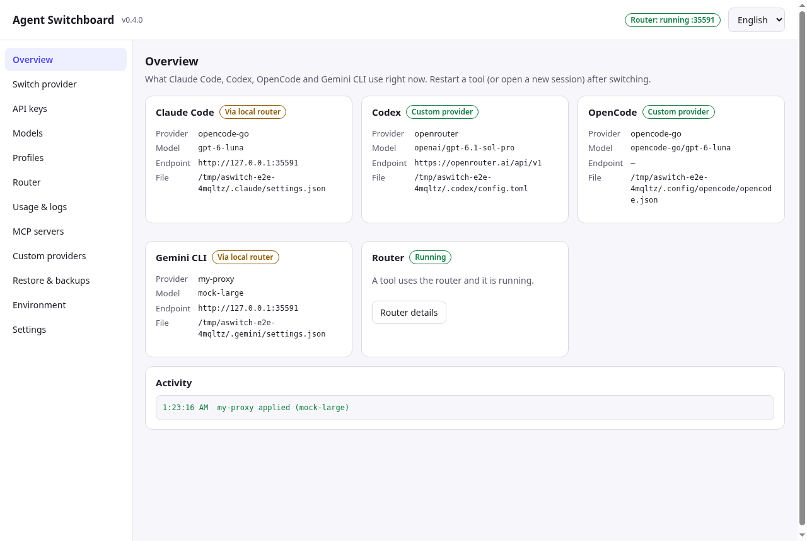

> **In one sentence:** Agent Switchboard edits the official config files of Claude Code, Codex, OpenCode and Gemini CLI for you, so you can point them at OpenRouter, OpenCode Zen/Go, OpenAI, DeepSeek, Kimi, GLM, Gemini, MiniMax, xAI, Groq, Mistral, Cerebras, NVIDIA, SiliconFlow, Ollama, LM Studio or your own endpoint, pick the newest model from a live list, and go back to your subscription login or your original files with one click.

It comes as a **desktop app** (macOS, Windows, Linux) and as a **zero-dependency CLI** (`aswitch`). Both use the same core, the same files and the same backups. The whole app speaks **English and Turkish**.

---

## Contents

- [Why?](#why)
- [Features](#features)
- [Screenshots](#screenshots)
- [Install](#install)
- [First run (5 minutes)](#first-run-5-minutes)
- [Desktop app walkthrough](#desktop-app-walkthrough)
- [CLI reference](#cli-reference)
- [Recipes](#recipes)
- [How it works](#how-it-works)
- [Exactly which files are touched](#exactly-which-files-are-touched)
- [Compatibility matrices](#compatibility-matrices)
- [Language (English / Türkçe)](#language-english--türkçe)
- [Security and privacy](#security-and-privacy)
- [OAuth and terms of service](#oauth-and-terms-of-service)
- [Troubleshooting / FAQ](#troubleshooting--faq)
- [Limitations](#limitations)
- [Comparison with similar projects](#comparison-with-similar-projects) · [Competitive analysis (32 projects)](docs/COMPETITIVE-ANALYSIS.md)
- [Roadmap](#roadmap)
- [Contributing](#contributing) · [Security policy](SECURITY.md) · [Changelog](CHANGELOG.md) · [Audit report](docs/AUDIT.md) · [Automation](docs/AUTOMATION.md) · [License](#license)

---

## Why?

Claude Code, Codex, OpenCode and Gemini CLI are great coding agents, but each one is configured differently:

- Claude Code reads environment variables from `~/.claude/settings.json`.
- Codex reads TOML from `~/.codex/config.toml` and, today, only talks the OpenAI **Responses** API.
- OpenCode reads `~/.config/opencode/opencode.json`.
- Gemini CLI reads `~/.gemini/.env` and `~/.gemini/settings.json`, and only talks the Gemini API.

Trying a different provider or model means editing four different files by hand, remembering which variable does what, and hoping you can undo it later. Some models are also served on an API the tool does not speak (for example a Responses-only `gpt-*` model inside Claude Code).

Agent Switchboard does that work for you:

1. **Save a key once** (or sign in to OpenRouter with OAuth).
2. **Pick a provider and a model** from the live list (or just say `latest`).
3. **Apply** to one or all four tools — or save the combination as a **profile** and switch with one click (also from the tray).
4. If the model speaks a different API than the tool, the built-in **local router** translates on the fly.
5. **Go back** to your subscription (`official`) or to your untouched original files (`restore`) at any time.

It only changes the settings it manages. Your themes, permissions, MCP servers and other settings stay exactly as they were.

## Features

| | |
|---|---|
| 🔀 **Switch providers** | 18 built-in providers + any OpenAI- or Anthropic-compatible endpoint you add. Four tools: Claude Code, Codex, OpenCode, **Gemini CLI**. |
| 🗂️ **Profiles** | Save what every tool uses as a named profile and apply it in one step; bind a project folder to a profile (`.aswitch.json`, used by `aswitch run`). Export/import to move to another machine. |
| 🧠 **Live model lists** | Fetched from each provider's `/models` endpoint (cached 6 h). `latest` / `latest:sonnet` resolve to the newest match when you apply. |
| 🔁 **Local translating router** | Claude Code → Chat Completions or OpenAI Responses; Codex → Chat Completions; Gemini CLI → Messages, Chat or Responses. Tools, images, streaming and **thinking/reasoning** included. Listens on `127.0.0.1` only. |
| 🛟 **Fallback chain** | If the provider answers 429/5xx or is unreachable, the router tries the next provider/model you listed. |
| 📊 **Usage & request log** | Tokens, latency, time to first token and estimated cost per request that goes through the router. Metadata only — never prompts or keys. |
| ⏱️ **Endpoint test** | Latency and key check for every provider in one click (`aswitch ping`). |
| 🔌 **MCP sync** | See the MCP servers of all four tools and copy them from one tool to the others. |
| 🎯 **Per-model endpoints** | OpenCode Zen/Go serve each model on its own API; aswitch picks direct or router per model and refuses combinations that cannot work, before writing anything. |
| 🔑 **Keys & OAuth** | Keys stored locally (owner-only file on macOS/Linux). OpenRouter sign-in with official OAuth PKCE. |
| ↩️ **Safe undo** | Original file kept on first touch, timestamped backup before every change (last 50), one-click restore of any single backup. |
| 🖥️ **Desktop app** | Everything the CLI does, no terminal needed. Tray / menu-bar quick switch, router start/stop/auto-start, update notice, clean shutdown on quit, single instance. |
| 🌍 **English + Türkçe** | UI, CLI help and errors, router errors, menus and window title. Follows your OS language, switchable any time. |
| ♿ **Accessible** | Keyboard-navigable tabs (WAI-ARIA), labelled controls, live region for results. |
| 📦 **Zero runtime dependencies** | Pure Node.js ≥ 18 for the CLI. Tested on macOS, Windows and Linux with Node 18/20/22. |

## Screenshots

All screenshots are of the real app, captured by the automated Electron test (`desktop/test/e2e.mjs`) in a sandboxed home folder with demo keys.

| First run | Switch provider |
|---|---|
| 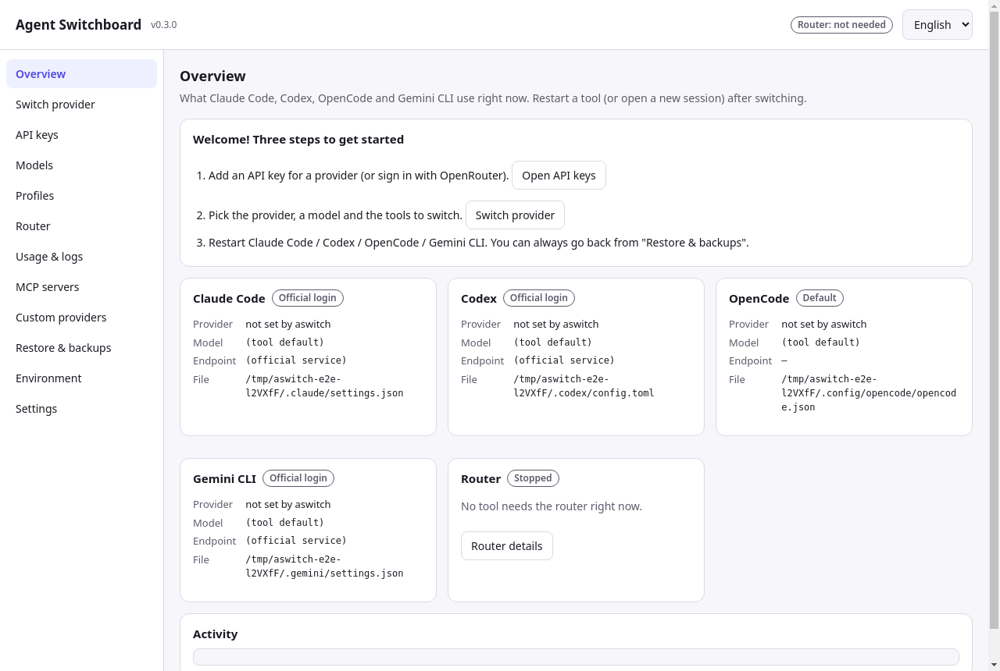 | 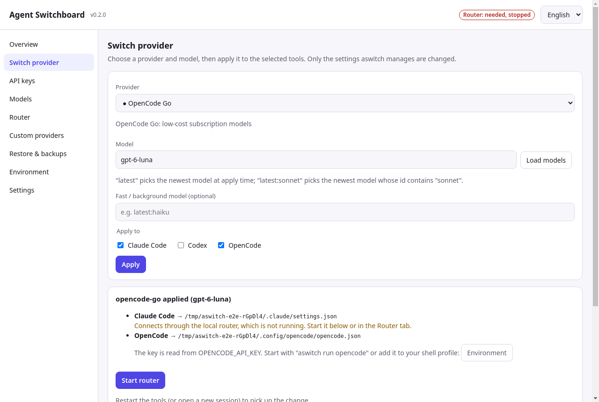 |
| **Profiles** | **Usage & request log** |
| 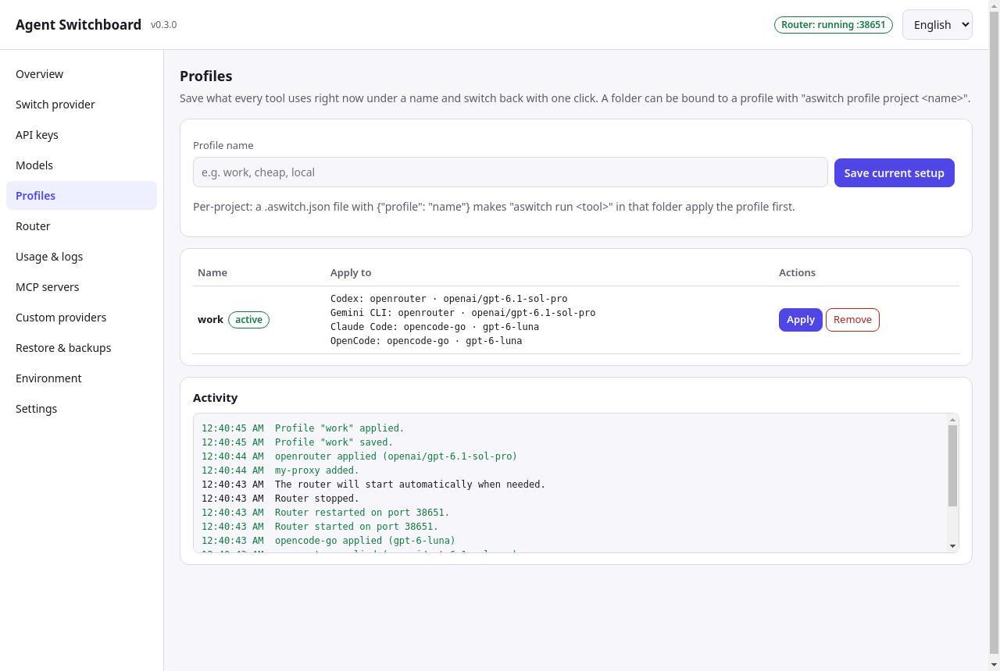 | 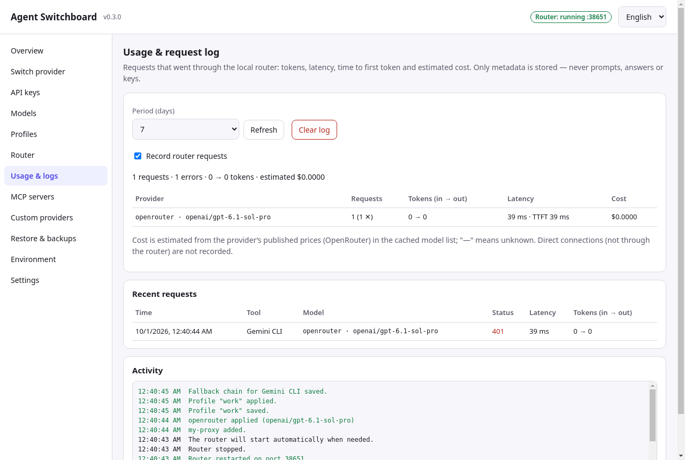 |
| **MCP servers** | **Settings (import/export, updates)** |
| 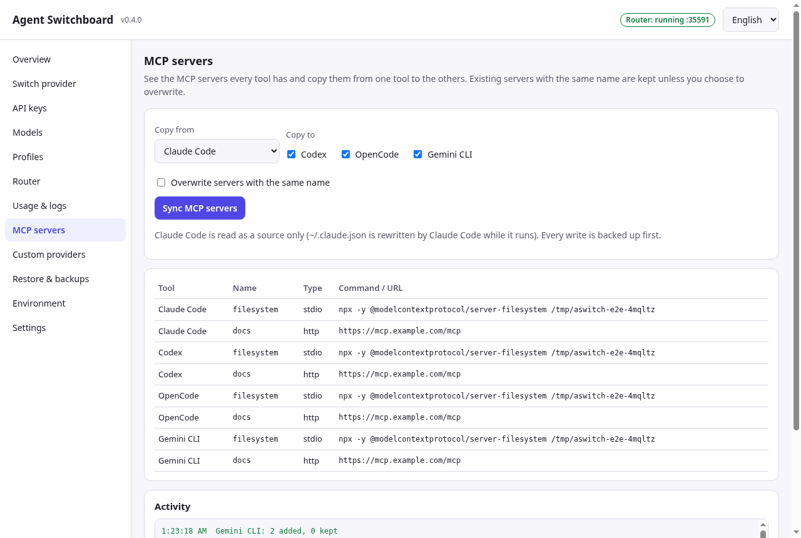 | 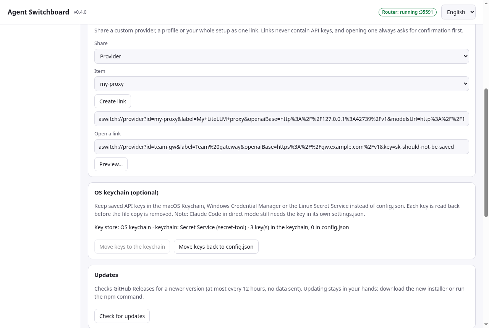 |
| **API keys** | **Live models with search** |
| 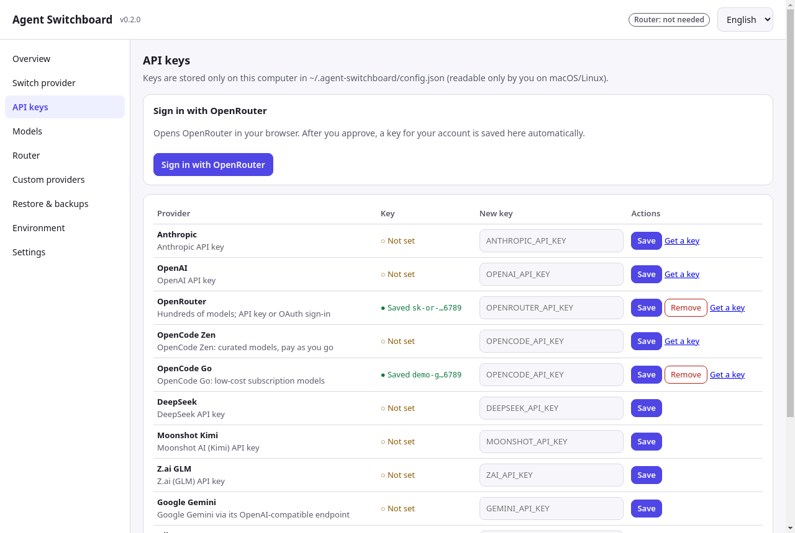 | 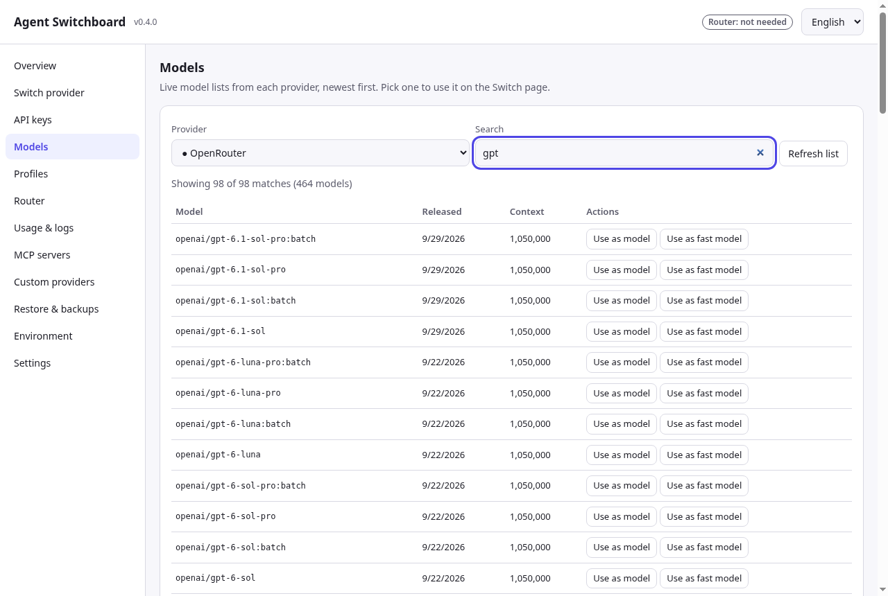 |
| **Router** | **Restore & backups** |
| 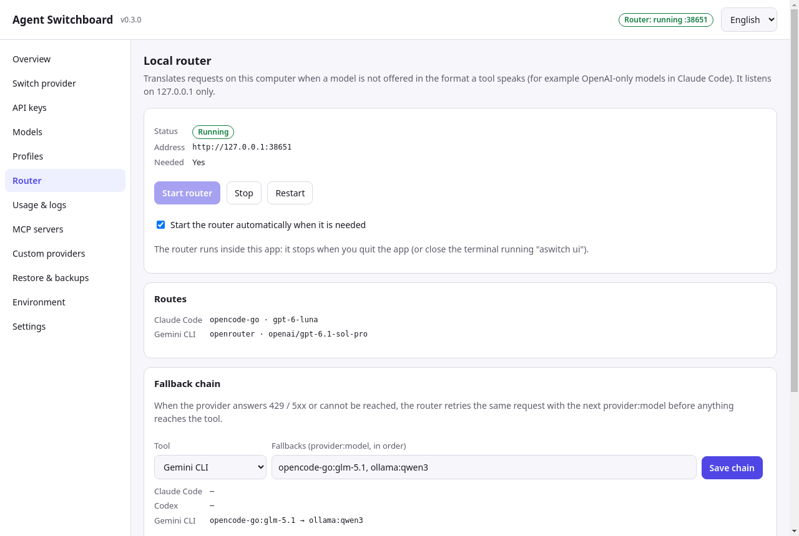 | 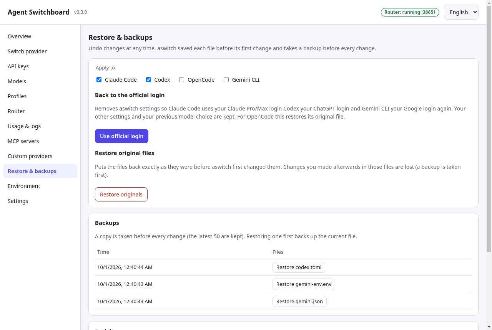 |
| **Custom providers** | **Environment variables** |
| 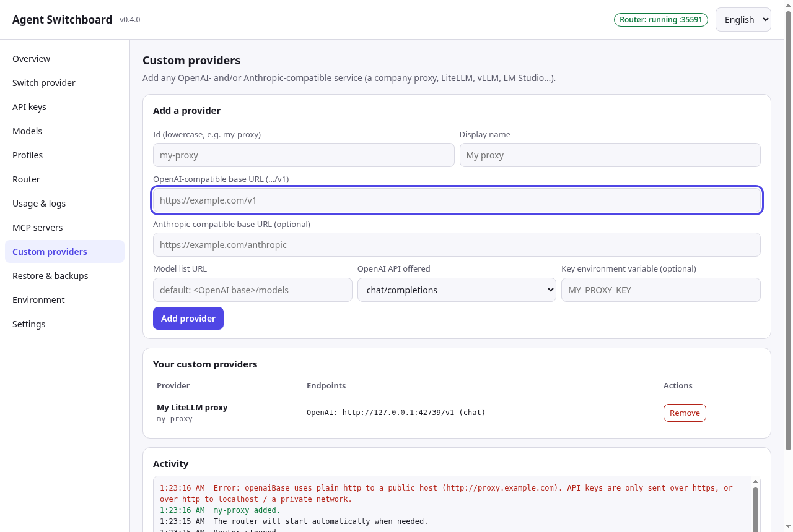 | 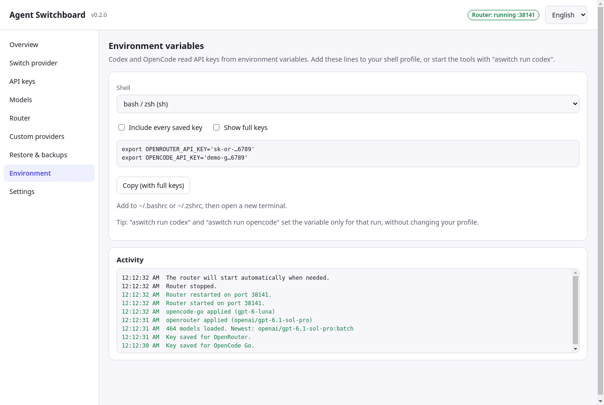 |

Türkçe arayüz: [README.tr.md](README.tr.md) · 

## Install

### Desktop app (recommended for most people)

Download the file for your system from the [latest release](https://github.com/cumabozkurt/agent-switchboard/releases/latest):

| System | File | Notes |
|---|---|---|
| **Windows 10/11 (x64)** | `Agent.Switchboard-Setup-<version>-win-x64.exe` | Installer (Start menu shortcut, uninstaller). |
| | `Agent.Switchboard-Portable-<version>-win-x64.exe` | No install; run from anywhere. |
| **macOS, Apple Silicon** | `Agent.Switchboard-<version>-mac-arm64.dmg` (or `.zip`) | M1/M2/M3/M4… |
| **macOS, Intel** | `Agent.Switchboard-<version>-mac-x64.dmg` (or `.zip`) | |
| **Linux (x64)** | `Agent.Switchboard-<version>-linux-x86_64.AppImage` | `chmod +x` then run. |
| | `Agent.Switchboard-<version>-linux-amd64.deb` | `sudo apt install ./Agent.Switchboard-*.deb` |

The builds are **not code-signed** yet:

- **Windows:** SmartScreen may say "Windows protected your PC". Click **More info → Run anyway**.
- **macOS:** Gatekeeper may block the first launch. Right-click the app → **Open** → **Open**. If macOS says the app "is damaged", run `xattr -dr com.apple.quarantine "/Applications/Agent Switchboard.app"`.
- **Linux AppImage:** some distributions need `libfuse2` (`sudo apt install libfuse2`).

### CLI (for terminal users)

You need [Node.js](https://nodejs.org/) 18 or newer.

```bash
# macOS / Linux / Windows (PowerShell or cmd)
npm install -g github:cumabozkurt/agent-switchboard
aswitch --version
```

Or from a clone:

```bash
git clone https://github.com/cumabozkurt/agent-switchboard
cd agent-switchboard
npm link          # makes the `aswitch` command available
```

The CLI also includes the control panel: `aswitch ui` opens the same interface in your browser (bound to `127.0.0.1`, protected by a one-time token).

**Update:** the desktop app and `aswitch update` tell you when a new release exists (notify-only; see [Limitations](#limitations)). Run the same `npm install -g …` command again, or download the new desktop build. **Uninstall:** run `aswitch restore` first if you want your original files back, then `npm rm -g agent-switchboard` (or uninstall the app) and delete `~/.agent-switchboard`.

## First run (5 minutes)

**Desktop app**

1. Open **Agent Switchboard**. The **Overview** shows what each tool uses right now. Nothing has changed yet.
   
2. Go to **API keys**. Paste a key for your provider and press **Save**, or press **Sign in with OpenRouter** to get a key through your browser.
3. Go to **Switch provider**. Choose the provider, click **Load models** (or type `latest`), tick the tools, and press **Apply**.
   
4. If the result says *"Connects through the local router"*, press **Start router** (or leave **Start the router automatically when needed** on, which is the default in the Router tab).
5. Restart Claude Code / Codex / OpenCode / Gemini CLI, or open a new session. Done.
6. Changed your mind? **Restore & backups → Use official login** or **Restore originals**.

**CLI**

```bash
aswitch key set openrouter           # asks for the key without echoing it
aswitch models openrouter --filter claude
aswitch use openrouter --model latest:claude-sonnet --tools claude
aswitch status
```

## Desktop app walkthrough

| Tab | What you can do |
|---|---|
| **Overview** | Per-tool cards (mode, provider, model, endpoint, file), router state, welcome guide on first run, a warning when shell variables override the config, activity log. |
| **Switch provider** | Provider, model (with `latest` / `latest:filter`), optional fast/background model, choose tools, **Apply**. Shows exactly what was written and whether the router is needed. |
| **API keys** | Save/remove a key per provider (masked, shows whether it comes from the saved config or an environment variable), links to each provider's key page, OpenRouter OAuth sign-in, **Test endpoints** (latency + key status). |
| **Profiles** | Save the current setup under a name, apply or delete profiles; the active profile is marked. |
| **Models** | Live list for any provider, refresh, search box, click a model to use it. |
| **Router** | Running / stopped / external state, address and port, **Start / Stop / Restart**, auto-start option, the current routes, the **fallback chain** per tool. The router stops cleanly when you quit the app. |
| **Usage & logs** | Requests per provider/model, tokens, latency, TTFT, estimated cost, recent requests; turn logging on/off, clear the log. |
| **MCP servers** | Every tool's MCP servers in one table; copy from one tool to the others (keep or overwrite same-name servers). |
| **Custom providers** | Add any OpenAI-compatible (and optionally Anthropic-compatible) endpoint: id, name, base URLs, models URL, wire API (Responses/Chat), key variable. Remove it again. |
| **Restore & backups** | Back to official login (Claude Pro/Max, ChatGPT), restore original files per tool, list every timestamped backup and restore any one of them (the current file is backed up first). |
| **Environment** | The exact lines to add to your shell profile (sh/zsh/bash, fish, PowerShell, cmd) for Codex/OpenCode keys. Values are masked until you press **Show full keys**. |
| **Settings** | Language (Auto / English / Türkçe), router auto-start, **import / export**, **check for updates**, the paths of every file aswitch uses, version. |

**Tray / menu bar:** while the app runs, its icon offers the saved profiles, *all tools → official login*, router start/stop, open window and quit. Closing the window quits the app (and the router it started).

The language switcher is always in the top-right corner. The menu bar and window title follow the chosen language.

## CLI reference

Global option: `--lang en|tr` (also `ASWITCH_LANG=en|tr`). Put it before the command, e.g. `aswitch --lang tr status`.

| Command | What it does | Example |
|---|---|---|
| `aswitch status [--json]` | What each tool uses now, and whether the router is needed. | `aswitch status` |
| `aswitch providers` | Built-in and custom providers; `●` = key available. | `aswitch providers` |
| `aswitch key set <provider> [key]` | Save a key. Without `[key]` it asks without echo (keeps it out of shell history). | `aswitch key set opencode-go` |
| `aswitch key rm <provider>` | Remove a saved key. | `aswitch key rm openai` |
| `aswitch key get <provider>` | Print a key (used by `--codex-key command`). | `aswitch key get openrouter` |
| `aswitch login openrouter [--port 3000]` | OpenRouter OAuth (PKCE) in your browser; the key is saved. | `aswitch login openrouter` |
| `aswitch models <provider> [--refresh] [--filter x] [--limit 50] [--json]` | Live model list, newest first. | `aswitch models opencode-zen --filter claude` |
| `aswitch use <provider> [--model m] [--fast m] [--tools …] [--codex-key env\|command] [--port p]` | Apply provider + model to the tools (default: every installed tool; Gemini CLI when `~/.gemini` exists). | `aswitch use openrouter --model latest:claude-opus --fast latest:claude-haiku` |
| `aswitch official [--tools claude,codex,gemini]` | Remove aswitch settings and go back to the tool's own login. `--tools opencode` restores OpenCode's original file. | `aswitch official` |
| `aswitch restore [--tools …]` | Put files back exactly as they were before aswitch touched them. | `aswitch restore --tools codex` |
| `aswitch backups` | List timestamped backups. | `aswitch backups` |
| `aswitch backups restore <id> <file>` | Restore one backup (current file is backed up first). | `aswitch backups restore 2026-09-30T21-08-51-439Z claude.json` |
| `aswitch provider add <id> --openai-base URL [--anthropic-base URL] [--models-url URL] [--wire responses\|chat] [--key-env NAME] [--label name]` | Add a custom provider. | `aswitch provider add myproxy --openai-base http://localhost:8000/v1 --wire chat` |
| `aswitch provider rm <id>` | Remove a custom provider (and its saved key). | `aswitch provider rm myproxy` |
| `aswitch router [--port 3456]` | Run the local translating router in the foreground (Ctrl+C stops it cleanly). | `aswitch router` |
| `aswitch run <claude\|codex\|opencode\|gemini> [args…]` | Start a tool with the saved key in its environment (and the folder's profile applied first); args are passed through. | `aswitch run codex --full-auto` |
| `aswitch profile save\|use\|rm <name>`, `aswitch profile list` | Save what the tools use now / apply / delete / list profiles. | `aswitch profile save cheap` |
| `aswitch profile project <name>` | Write `.aswitch.json` in the current folder; `aswitch run` applies that profile here. | `aswitch profile project work` |
| `aswitch ping [provider …] [--json]` | Endpoint latency and key status. | `aswitch ping openrouter deepseek` |
| `aswitch fallback [set <tool> p:model … \| clear <tool>]` | Router fallback chain on 429/408/5xx/network errors (claude, codex, gemini). | `aswitch fallback set claude opencode-go:glm-5.1 ollama:qwen3` |
| `aswitch usage [--days 7] [--recent] [--json] [--clear] [--log on\|off]` | Router request log: tokens, latency, TTFT, estimated cost. | `aswitch usage --recent` |
| `aswitch mcp [list] [--json]` | MCP servers of every tool. | `aswitch mcp` |
| `aswitch mcp sync [--from claude] [--to codex,opencode,gemini] [--only a,b] [--overwrite]` | Copy MCP servers between tools (backups first). | `aswitch mcp sync --to gemini` |
| `aswitch export [file] [--with-keys]` / `aswitch import <file> [--overwrite]` | Move custom providers, profiles, fallbacks and settings (keys only on request). | `aswitch export setup.json` |
| `aswitch update` | Check GitHub for a newer release (also: `ASWITCH_NO_UPDATE_CHECK=1` disables automatic checks). | `aswitch update` |
| `aswitch env [--shell sh\|fish\|powershell\|cmd] [--all]` | Print `export` lines for the active Codex/OpenCode keys. | `aswitch env --shell powershell` |
| `aswitch ui [--port 4567] [--no-open]` | Open the control panel in your browser. | `aswitch ui` |
| `aswitch lang [en\|tr\|auto]` | Show or set the interface language (saved in config). | `aswitch lang tr` |
| `aswitch --version`, `aswitch --help` | Version / help. | |

**Model aliases:** `--model latest` picks the newest model of the provider; `--model latest:sonnet` the newest model whose id contains `sonnet`. For lists without dates (OpenCode Zen/Go) the order is by version number, so use a specific filter such as `latest:claude-opus`.

## Recipes

### OpenRouter in Claude Code (and Codex)

```bash
aswitch login openrouter                         # or: aswitch key set openrouter
aswitch use openrouter --model latest:claude-sonnet --fast latest:claude-haiku --tools claude,codex
aswitch run codex                                # Codex reads OPENROUTER_API_KEY from the environment
```

Claude Code connects **directly** to OpenRouter's Anthropic-compatible endpoint; Codex uses OpenRouter's Responses API directly. No router needed.

### OpenCode Zen / Go inside Claude Code and Codex

```bash
aswitch key set opencode-zen                     # same key works for opencode-go (OPENCODE_API_KEY)
aswitch use opencode-zen --model latest:claude-opus --tools claude     # direct (/messages)
aswitch use opencode-zen --model latest:gpt --tools codex              # direct (/responses)
aswitch use opencode-go  --model latest:gpt --tools claude             # router: Messages → Responses
aswitch use opencode-go  --model glm-5 --tools codex                   # router: Responses → Chat
aswitch router                                                          # keep running (or use the desktop app)
```

### OpenAI models in Claude Code

```bash
aswitch key set openai
aswitch use openai --model gpt-5 --tools claude
aswitch router          # Claude Code → http://127.0.0.1:3456 → OpenAI Responses API
```

### Gemini CLI with any provider

```bash
aswitch key set gemini
aswitch use gemini --model gemini-2.5-pro --tools gemini          # direct (Google AI Studio key)
aswitch use openrouter --model latest:claude-sonnet --tools gemini # router: Gemini API → Anthropic Messages
aswitch run gemini                                                  # or start "gemini" normally
```

Gemini CLI reads `~/.gemini/.env` only when there is no `.env` in the project folder (or its parents). `aswitch run gemini` sets the variables directly, so it works everywhere.

### Profiles, per-project setups and fallback

```bash
aswitch use deepseek --model deepseek-chat --tools claude,codex && aswitch profile save cheap
aswitch official && aswitch profile save sub
cd ~/work/client-a && aswitch profile project cheap    # this folder always uses "cheap"
aswitch run claude                                     # applies "cheap", then starts Claude Code
aswitch fallback set claude openrouter:anthropic/claude-sonnet-4.5   # if DeepSeek is down
```

### Share MCP servers

```bash
aswitch mcp                                   # what each tool has
aswitch mcp sync --from claude --to codex,opencode,gemini
```

### A local model with Ollama

```bash
aswitch use ollama --model qwen3-coder --tools opencode,codex
```

### Your own gateway / proxy

```bash
aswitch provider add mygw --openai-base https://gw.example.com/v1 --wire chat --key-env MYGW_KEY
aswitch key set mygw
aswitch use mygw --model my-model --tools claude,codex,opencode
```

### Going back to your subscription login

```bash
aswitch official                  # Claude Code → Claude Pro/Max login, Codex → ChatGPT login
```

Only the settings aswitch wrote are removed; your previous `model` line is put back.

### Full restore

```bash
aswitch restore                   # every file becomes byte-for-byte what it was before aswitch
```

If a file did not exist before aswitch, `restore` deletes it again.

## How it works

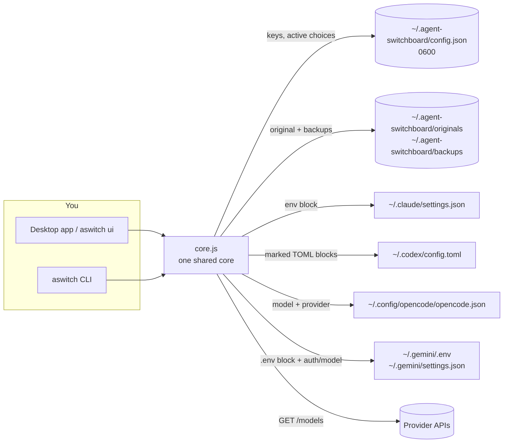

**What happens when you press Apply** (or run `aswitch use`):

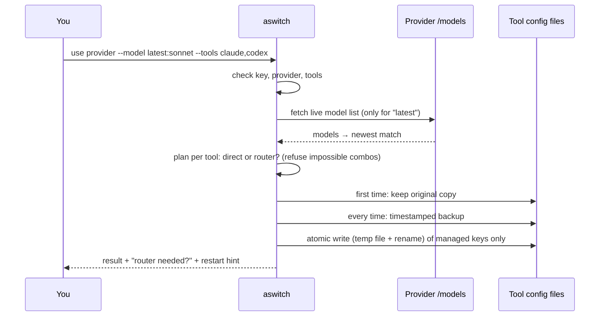

**How the router translates** (only when the model's API differs from the tool's):

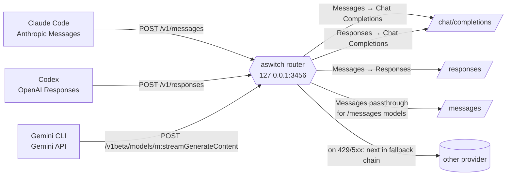

The router re-reads the config on every request, so switching models does not need a restart. Text, tool calls/results, images, streaming (SSE) and thinking/reasoning are translated; errors are returned in the calling tool's own error format. Gemini CLI requests are first converted to Anthropic Messages, then take the same path as Claude Code. If a request fails with 429, 408, 5xx or a network error before anything was streamed, the next entry of the tool's fallback chain is tried. Each request's metadata (no content) goes to the usage log.

## Exactly which files are touched

| Tool | File (override) | What aswitch writes |
|---|---|---|
| Claude Code | `~/.claude/settings.json` (`CLAUDE_CONFIG_DIR`) — on Windows `%USERPROFILE%\.claude\settings.json` | In `env`: `ANTHROPIC_BASE_URL`, `ANTHROPIC_AUTH_TOKEN` (for Anthropic itself: `ANTHROPIC_API_KEY`), `ANTHROPIC_MODEL`, `ANTHROPIC_DEFAULT_OPUS_MODEL`, `ANTHROPIC_DEFAULT_SONNET_MODEL`, `ANTHROPIC_DEFAULT_FABLE_MODEL`, `ANTHROPIC_DEFAULT_HAIKU_MODEL` (fast model), `CLAUDE_CODE_SUBAGENT_MODEL`; the top-level `model`. Written with `0600` permissions. |
| Codex | `~/.codex/config.toml` (`CODEX_HOME`) | A marked block at the top (`model_provider = "aswitch"`, `model`) and a marked `[model_providers.aswitch]` table at the end (`name`, `base_url`, `wire_api = "responses"`, `env_key`, `env_key_instructions`, or an `auth` command with `--codex-key command`). Everything else, including CRLF line endings, is preserved. |
| OpenCode | `~/.config/opencode/opencode.json` (or existing `opencode.jsonc`; `XDG_CONFIG_HOME`) | `model` (e.g. `openrouter/anthropic/claude-sonnet-4.5`); for providers OpenCode does not know, a `provider.<id>` block using `@ai-sdk/openai-compatible` (or `@ai-sdk/openai` for Responses) with the key as `{env:NAME}`. |
| Gemini CLI | `~/.gemini/.env` and `~/.gemini/settings.json` (`GEMINI_CLI_HOME`) | In `.env` a marked block (placed last, `0600`): `GOOGLE_GEMINI_BASE_URL` (router or Google), `GEMINI_API_KEY`, `GEMINI_MODEL`. In `settings.json`: `model.name` and `security.auth.selectedType = "gemini-api-key"`. The previous values are remembered and put back by `official`. |
| MCP sync (only when you run it) | Codex `config.toml` (own marked block), OpenCode `mcp`, Gemini `mcpServers` | Only the servers you copy; everything backed up first. `~/.claude.json` is only read. |
| Project | `.aswitch.json` (only with `aswitch profile project`) | `{"profile": "<name>"}` |
| aswitch | `~/.agent-switchboard/` (`ASWITCH_DIR`) | `config.json` (keys, custom providers, active choices, profiles, fallbacks, language, router port; `0600`), `usage.jsonl` (router request metadata, `0600`, max 5000 lines), `originals/`, `backups/`, model cache, update-check cache. Folder is `0700`. |

Real example after `aswitch use openrouter --model anthropic/claude-sonnet-4.5 --fast anthropic/claude-haiku-4.5`:

<details><summary><code>~/.claude/settings.json</code></summary>

```json
{
  "env": {
    "ANTHROPIC_BASE_URL": "https://openrouter.ai/api",
    "ANTHROPIC_AUTH_TOKEN": "sk-or-v1-…",
    "ANTHROPIC_API_KEY": "",
    "ANTHROPIC_MODEL": "anthropic/claude-sonnet-4.5",
    "ANTHROPIC_DEFAULT_OPUS_MODEL": "anthropic/claude-sonnet-4.5",
    "ANTHROPIC_DEFAULT_SONNET_MODEL": "anthropic/claude-sonnet-4.5",
    "ANTHROPIC_DEFAULT_FABLE_MODEL": "anthropic/claude-sonnet-4.5",
    "CLAUDE_CODE_SUBAGENT_MODEL": "anthropic/claude-sonnet-4.5",
    "ANTHROPIC_DEFAULT_HAIKU_MODEL": "anthropic/claude-haiku-4.5"
  },
  "model": "anthropic/claude-sonnet-4.5"
}
```
</details>

<details><summary><code>~/.codex/config.toml</code></summary>

```toml
# >>> agent-switchboard >>>
model_provider = "aswitch"
model = "anthropic/claude-sonnet-4.5"
# <<< agent-switchboard <<<

# (your own settings stay here, untouched)

# >>> agent-switchboard >>>
[model_providers.aswitch]
name = "aswitch: OpenRouter"
base_url = "https://openrouter.ai/api/v1"
wire_api = "responses"
env_key = "OPENROUTER_API_KEY"
env_key_instructions = "Start with \"aswitch run codex\" or add the output of \"aswitch env\" to your shell profile (OPENROUTER_API_KEY)."
# <<< agent-switchboard <<<
```
</details>

<details><summary><code>~/.config/opencode/opencode.json</code></summary>

```json
{
  "$schema": "https://opencode.ai/config.json",
  "model": "openrouter/anthropic/claude-sonnet-4.5"
}
```
</details>

**Keys for Codex and OpenCode** are read from environment variables (that is how both tools are designed). Choose one:

- `aswitch run codex` / `aswitch run opencode` — sets the variable just for that run.
- Add the output of `aswitch env` to your shell profile (the **Environment** tab shows it for each shell).
- `aswitch use … --codex-key command` — Codex asks `aswitch key get <provider>` for the key (Codex's `[model_providers.<id>.auth]` feature). CLI installs only.

## Compatibility matrices

### Tools × providers

✅ direct · 🔁 through the local router · ❌ not possible

| Provider | Claude Code | Codex | OpenCode | Gemini CLI | Key variable |
|---|---|---|---|---|---|
| Anthropic | ✅ | 🔁 (Chat) | ✅ | 🔁 | `ANTHROPIC_API_KEY` |
| OpenAI | 🔁 (Responses) | ✅ | ✅ | 🔁 | `OPENAI_API_KEY` |
| OpenRouter | ✅ | ✅ | ✅ | 🔁 | `OPENROUTER_API_KEY` (or OAuth) |
| OpenCode Zen | per model ¹ | per model ¹ | ✅ | per model ¹ | `OPENCODE_API_KEY` |
| OpenCode Go | per model ¹ | per model ¹ | ✅ | per model ¹ | `OPENCODE_API_KEY` |
| DeepSeek | ✅ | 🔁 (Chat) | ✅ | 🔁 | `DEEPSEEK_API_KEY` |
| Moonshot Kimi | ✅ | 🔁 (Chat) | ✅ | 🔁 | `MOONSHOT_API_KEY` |
| Z.ai GLM | ✅ | 🔁 (Chat) | ✅ | 🔁 | `ZAI_API_KEY` |
| MiniMax | ✅ | 🔁 (Chat) | ✅ | 🔁 | `MINIMAX_API_KEY` |
| xAI (Grok) | 🔁 (Responses) | ✅ | ✅ | 🔁 | `XAI_API_KEY` |
| Groq · Mistral · Cerebras · NVIDIA NIM | 🔁 (Chat) | 🔁 (Chat) | ✅ | 🔁 | `GROQ_API_KEY` · `MISTRAL_API_KEY` · `CEREBRAS_API_KEY` · `NVIDIA_API_KEY` |
| SiliconFlow | ✅ | 🔁 (Chat) | ✅ | 🔁 | `SILICONFLOW_API_KEY` |
| Google Gemini | 🔁 (Chat) | 🔁 (Chat) | ✅ | ✅ | `GEMINI_API_KEY` |
| Ollama (local) | ✅ | ✅ (Ollama ≥ 0.13.3) | ✅ | 🔁 | none |
| LM Studio (local) | ✅ | ✅ | ✅ | 🔁 | none |
| Custom | depends on the URLs you give | | | | your choice |

¹ OpenCode Zen and Go serve each model on its own endpoint (see the next table).

### Model endpoint × tool

| The model is served on… | Claude Code | Codex |
|---|---|---|
| `/messages` (Anthropic) — e.g. Zen `claude-*`, most `qwen*`; Go `minimax-*`, `qwen*` | ✅ direct | ❌ |
| `/responses` (OpenAI Responses) — e.g. Zen/Go `gpt-*`, `grok-*` | 🔁 Messages → Responses | ✅ direct |
| `/chat/completions` — everything else | 🔁 Messages → Chat | 🔁 Responses → Chat |
| Google-native (Zen `gemini-*`) | ❌ | ❌ |

If the main model and the `--fast` model live on different endpoints, both go through the router (`/messages` models are passed through untouched).

### Key and auth modes

| Mode | Claude Code | Codex | OpenCode | Gemini CLI |
|---|---|---|---|---|
| Saved API key | written into `settings.json` (`0600`) | env var via `aswitch run` / `aswitch env` | `{env:NAME}` via `aswitch run` / `aswitch env` | direct: written into `~/.gemini/.env` (`0600`); router: a placeholder key |
| Key from your environment | used if nothing is saved | ✅ | ✅ | ✅ |
| OpenRouter OAuth (PKCE) | ✅ key saved after sign-in | ✅ | ✅ | ✅ |
| Codex auth command | — | `--codex-key command` → `aswitch key get` | — | — |
| Subscription login (Claude Pro/Max, ChatGPT, Google) | `aswitch official` → `claude /login` | `aswitch official` → `codex login` | — | `aswitch official` → Gemini CLI's own sign-in |

### Platforms

| | Windows 10/11 | macOS | Linux |
|---|---|---|---|
| CLI (Node 18/20/22) | ✅ tested in CI | ✅ tested in CI | ✅ tested in CI |
| Desktop app | ✅ x64 installer + portable | ✅ arm64 + x64 (dmg, zip) | ✅ x64 AppImage + deb |
| Shell snippets (`aswitch env`) | PowerShell, cmd | sh/zsh/bash, fish | sh/zsh/bash, fish |
| Desktop E2E test (Playwright over Electron, 40+ checks) | CI build only | CI build only | ✅ every push in CI (Xvfb) |

## Language (English / Türkçe)

- **Desktop:** language menu in the header (and in Settings, with *Auto*). The menu bar and window title switch too. The choice is saved.
- **CLI:** `aswitch --lang tr status`, `ASWITCH_LANG=tr aswitch …`, or save it with `aswitch lang tr` (`aswitch lang auto` goes back to automatic).
- **Order:** `--lang` / UI choice › `ASWITCH_LANG` › saved `lang` › OS language (Electron `app.getLocale()`, `LC_ALL`/`LC_MESSAGES`/`LANG`/`LANGUAGE`, `Intl`) › English.
- Router error messages shown in the tools are localized too. Text the router injects into prompts for models stays English on purpose (models understand it best).

Adding a language = one file in `src/i18n/` with the same keys; a test checks that every catalog has identical keys and placeholders, and that every key used in the code exists.

## Security and privacy

- **No telemetry, no accounts, no cloud.** aswitch talks only to the provider URLs you choose (model lists, OAuth, endpoint test) and to your local tools, plus one anonymous request to GitHub at most every 12 hours for the update notice (`ASWITCH_NO_UPDATE_CHECK=1` turns it off).
- **Usage log:** only metadata (time, tool, provider, model, status, latency, token counts). Never prompts, answers or keys. Turn it off with `aswitch usage --log off`.
- **Keys at rest:** `~/.agent-switchboard/config.json` is `0600`, its folder `0700` (macOS/Linux). On Windows the files live in your user profile, protected by your account's NTFS permissions. Keys are not encrypted — anyone who can read your user files can read them, exactly like the tools' own config files. Claude Code's `settings.json` is written with `0600` because it contains the token.
- **Local servers:** the control panel and the router listen on `127.0.0.1` only. The panel requires a random per-launch token, a matching `Host` header (DNS-rebinding protection), `Content-Type: application/json` (blocks cross-site form posts), limits bodies to 1 MB, and sends a strict Content-Security-Policy. The router rejects any request with an `Origin` header (browsers) or a non-local `Host`.
- **UI:** no `innerHTML` anywhere; every value is inserted as text. External links open in your system browser, never inside the app.
- **Commands:** `aswitch run` spawns the tool without a shell on macOS/Linux; on Windows it quotes each argument for `cmd.exe`. URLs are opened without a shell.
- **Masking:** keys are masked in the app (keys list, Environment tab) until you ask to see them; `aswitch status` never prints keys. `aswitch env` and `aswitch key get` print them on purpose (for your shell profile / Codex auth command).
- Found a problem? See [SECURITY.md](SECURITY.md).

## OAuth and terms of service

- **OpenRouter** offers an official OAuth PKCE flow for apps; `aswitch login openrouter` uses it and stores the resulting key like any other key.
- **Claude Pro/Max, ChatGPT and Google subscriptions** are meant for their official clients. aswitch **never** copies, reads or forwards those login tokens to other tools, and it does not pool accounts. `aswitch official` simply removes aswitch's settings so Claude Code, Codex and Gemini CLI use their own login again. Profile export never contains those tokens.
- You are responsible for following each provider's terms (for example, rate limits and allowed use of their API keys).

## Troubleshooting / FAQ

<details><summary><b>I applied a provider but the tool still uses the old one.</b></summary>

Restart the tool or open a new session. Check `aswitch status` — it warns when an environment variable overrides the file: for Claude Code, an exported `ANTHROPIC_MODEL`, `ANTHROPIC_BASE_URL` or `ANTHROPIC_API_KEY` in your shell wins over `settings.json`; for Gemini CLI, `GEMINI_API_KEY` / `GOOGLE_GEMINI_BASE_URL` in your shell or a `.env` file in the project folder wins over `~/.gemini/.env` (use `aswitch run gemini`). Project-level `.claude/settings.json` or `.claude/settings.local.json` files also override user settings.
</details>

<details><summary><b>"Connects through the local router, which is not running."</b></summary>

Start it: desktop **Router → Start router** (or keep auto-start on), or `aswitch router` in a terminal that stays open. With the CLI router, closing the terminal stops it.
</details>

<details><summary><b>"Port 3456 is already in use."</b></summary>

Another program (or another aswitch router) uses the port. The desktop app detects an aswitch router that is already running and shows it as *external*. Otherwise use another port: `aswitch use <provider> … --port 3999` then `aswitch router --port 3999`. The chosen port is remembered.
</details>

<details><summary><b>Codex says the environment variable is missing.</b></summary>

Start Codex with `aswitch run codex`, or add the output of `aswitch env` to your shell profile and open a new terminal, or use `--codex-key command`.
</details>

<details><summary><b>"… is not valid JSON. The file was not changed."</b></summary>

Your config file has a syntax error (Claude Code requires strict JSON). aswitch never overwrites a file it cannot parse. Fix the file, or restore a backup from **Restore & backups**. OpenCode's `.jsonc` comments are supported.
</details>

<details><summary><b>The model list is empty or old.</b></summary>

Press **Refresh list** (or `--refresh`). Lists are cached for 6 hours. Some providers need a key for `/models`. Network errors show the reason (e.g. `ECONNREFUSED`, `ENOTFOUND`). Offline, aswitch falls back to the last cached list, then to the snapshot bundled with the release (OpenRouter, OpenCode Zen, OpenCode Go; refreshed daily in the repository).
</details>

<details><summary><b>How do I undo everything?</b></summary>

`aswitch restore` (or **Restore originals** in the app). Then you can delete `~/.agent-switchboard`.
</details>

<details><summary><b>Does it work with the Claude Code / Codex IDE extensions and desktop apps?</b></summary>

They read the same user config files, so changes apply to them too, as far as each product reads those files.
</details>

## Limitations

- Thinking is translated as readable text (reasoning summaries / `reasoning_content`); encrypted reasoning is not carried across providers. Claude Code → Responses is stateless (`store: false`). `stop_sequences` reach Chat providers only (max 4). Provider-hosted tools (web search) are not forwarded. `count_tokens` is an estimate.
- Codex cannot use `/messages`-only models (no Responses → Messages translation). Google-native models on OpenCode Zen (`gemini-*`) cannot be used from Claude Code, Codex or Gemini CLI.
- Gemini CLI: a `.env` file in the project folder (or a parent) hides `~/.gemini/.env`; use `aswitch run gemini` there. Gemini's own Google-login modes (Code Assist / Vertex) are left untouched by `official`.
- The fallback chain only helps before the first byte is streamed; a stream that breaks midway is not replayed (that would duplicate output). No load balancing or circuit breaker (this is a single-user tool).
- Cost in the usage log is an **estimate** from the prices in the provider's model list (OpenRouter publishes them; many others do not → "—"). Direct connections (without the router) are not logged.
- MCP sync: Claude Code is a source only (it rewrites `~/.claude.json` while it runs). Remote MCP servers with OAuth need to be signed in again in each tool.
- Updates are **notify-only**: the builds are unsigned, and macOS will not auto-install unsigned updates, so the app shows the new version and a link instead of installing it silently. Deep links (`aswitch://`) are not implemented yet.
- The tray icon exists only while the desktop app is open; closing the window quits the app.
- Keys are stored in a permission-protected file, not in the OS keychain.
- Desktop builds are unsigned. Linux builds are x64 only (no arm64 yet).
- On Windows, `aswitch run` passes arguments through `cmd.exe`; arguments containing `%VAR%` may be expanded by cmd.
- The Electron end-to-end test runs on Linux (CI, every push); macOS and Windows desktop builds are produced by CI but not UI-tested automatically.

## Comparison with similar projects

We cloned and read 33 candidate projects (32 met the criteria) for 0.3.0 — the full table and notes are in [docs/COMPETITIVE-ANALYSIS.md](docs/COMPETITIVE-ANALYSIS.md). The three best known, compared on points we checked in their READMEs and code (September 2026):

| | **Agent Switchboard** | [cc-switch](https://github.com/farion1231/cc-switch) | [cc-switch-cli](https://github.com/SaladDay/cc-switch-cli) | [claude-code-router](https://github.com/musistudio/claude-code-router) |
|---|---|---|---|---|
| Form | Desktop app + CLI + browser panel | Desktop app (Tauri) | TUI + CLI (port of cc-switch) | CLI / local service + web UI |
| Tools managed | Claude Code, Codex, OpenCode, Gemini CLI | Claude Code, Codex, Gemini CLI, OpenCode, OpenClaw, Claude Desktop and more | Claude Code, Codex, Gemini CLI, OpenCode, OpenClaw, Hermes, pi | Claude Code (routing layer) |
| Local protocol translation | ✅ Messages⇄Chat, Messages⇄Responses, Responses⇄Chat, Gemini⇄Messages | Local proxy with format conversion | Local proxy | ✅ (core feature, transformers) |
| Fallback on errors | ✅ chain per tool | ✅ failover | ✅ failover | ✅ fallback models, retries |
| Usage / cost view | ✅ (router requests, estimated) | ✅ | — | ✅ logs |
| MCP server sync | ✅ 4 tools | ✅ | ✅ | — |
| Profiles / import-export | ✅ + per-project | ✅ | ✅ | config file |
| Tray / menu bar | ✅ | ✅ | — (terminal) | — |
| Byte-for-byte restore of original files | ✅ | — | backups | n/a |
| Runtime dependencies | 0 (Node.js only) | Native app | Rust binary | Node.js packages |
| UI languages | English, Türkçe | several | several | — |

cc-switch has a broader feature set (skills/prompt sync, cloud sync, deep links, 90+ presets). Agent Switchboard focuses on a zero-dependency CLI + app with the same features in both, a four-format router and exact restore. Corrections welcome.

## Roadmap

- Deep links (`aswitch://…`) to import a provider/profile from a web page
- Scenario routing (long context / images / background tasks → different models)
- OS keychain storage for keys (optional)
- Signed/notarized desktop builds with silent auto-update, Linux arm64
- More agent targets (Qwen Code, Crush …), more UI languages (contributions welcome)

## Contributing

Contributions are very welcome — see [CONTRIBUTING.md](CONTRIBUTING.md). Quick start:

```bash
git clone https://github.com/cumabozkurt/agent-switchboard && cd agent-switchboard
npm test                          # ~140 tests, node:test, no dependencies
cd desktop && npm install && npm run e2e   # Electron end-to-end test (Linux: xvfb-run -a npm run e2e)
cd desktop && npm install && npm start
```

## License

[MIT](LICENSE) © Cuma Bozkurt
