<div align="center">

# Agent Switchboard (`aswitch`)

**Claude Code, Codex, OpenCode ve Gemini CLI'ın arkasındaki API sağlayıcısı ve model için tek bir anahtar.**

[](README.md)
[](README.tr.md)

[](https://github.com/cumabozkurt/agent-switchboard/actions/workflows/ci.yml)
[](https://github.com/cumabozkurt/agent-switchboard/releases/latest)
[](LICENSE)
[](#kurulum)
[](package.json)
[](package.json)

</div>

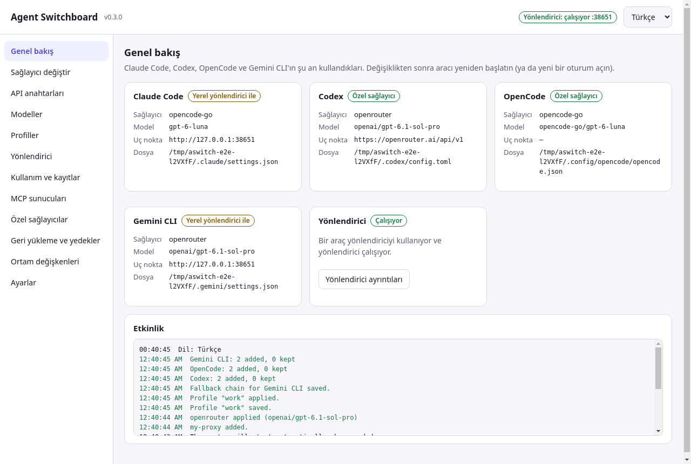

> **Tek cümleyle:** Agent Switchboard, Claude Code, Codex, OpenCode ve Gemini CLI'ın resmî ayar dosyalarını sizin yerinize düzenler. Böylece bu araçları OpenRouter, OpenCode Zen/Go, OpenAI, DeepSeek, Kimi, GLM, Gemini, MiniMax, xAI, Groq, Mistral, Cerebras, NVIDIA, SiliconFlow, Ollama, LM Studio ya da kendi uç noktanıza yönlendirebilir, canlı listeden en yeni modeli seçebilir ve tek tıkla abonelik girişinize veya orijinal dosyalarınıza geri dönebilirsiniz.

Hem **masaüstü uygulaması** (macOS, Windows, Linux) hem de **bağımlılıksız bir CLI** (`aswitch`) olarak gelir. İkisi de aynı çekirdeği, aynı dosyaları ve aynı yedekleri kullanır. Uygulamanın tamamı **Türkçe ve İngilizce** konuşur.

---

## İçindekiler

- [Neden?](#neden)
- [Özellikler](#özellikler)
- [Ekran görüntüleri](#ekran-görüntüleri)
- [Kurulum](#kurulum)
- [İlk kullanım (5 dakika)](#i̇lk-kullanım-5-dakika)
- [Masaüstü uygulaması turu](#masaüstü-uygulaması-turu)
- [CLI başvurusu](#cli-başvurusu)
- [Tarifler](#tarifler)
- [Nasıl çalışır](#nasıl-çalışır)
- [Hangi dosyalara tam olarak ne yazılır](#hangi-dosyalara-tam-olarak-ne-yazılır)
- [Uyumluluk tabloları](#uyumluluk-tabloları)
- [Dil (Türkçe / English)](#dil-türkçe--english)
- [Güvenlik ve gizlilik](#güvenlik-ve-gizlilik)
- [OAuth ve kullanım koşulları](#oauth-ve-kullanım-koşulları)
- [Sorun giderme / SSS](#sorun-giderme--sss)
- [Sınırlamalar](#sınırlamalar)
- [Benzer projelerle karşılaştırma](#benzer-projelerle-karşılaştırma) · [Rakip analizi (33 proje, İngilizce)](docs/COMPETITIVE-ANALYSIS.md)
- [Yol haritası](#yol-haritası)
- [Katkı](#katkı) · [Güvenlik politikası](SECURITY.md) · [Değişiklik günlüğü](CHANGELOG.tr.md) · [Denetim raporu](docs/AUDIT.md) · [Otomasyon](docs/AUTOMATION.md) · [Lisans](#lisans)

---

## Neden?

Claude Code, Codex, OpenCode ve Gemini CLI harika kodlama ajanlarıdır, ama her biri farklı biçimde ayarlanır:

- Claude Code ortam değişkenlerini `~/.claude/settings.json` dosyasından okur.
- Codex `~/.codex/config.toml` içindeki TOML'u okur ve bugün yalnızca OpenAI **Responses** API'siyle konuşur.
- OpenCode `~/.config/opencode/opencode.json` dosyasını okur.
- Gemini CLI `~/.gemini/.env` ve `~/.gemini/settings.json` dosyalarını okur ve yalnızca Gemini API'siyle konuşur.

Başka bir sağlayıcı ya da model denemek; dört farklı dosyayı elle düzenlemek, hangi değişkenin ne işe yaradığını hatırlamak ve sonra geri alabilmeyi ummak demektir. Üstelik bazı modeller aracın konuşmadığı bir API ile sunulur (ör. Claude Code içinde yalnızca Responses ile sunulan bir `gpt-*` modeli).

Agent Switchboard bu işi sizin yerinize yapar:

1. **Anahtarı bir kez kaydedin** (ya da OpenRouter'a OAuth ile giriş yapın).
2. Canlı listeden **sağlayıcı ve model seçin** (ya da sadece `latest` deyin).
3. Bir ya da dört araca birden **uygulayın** — ya da bu birleşimi **profil** olarak kaydedip tek tıkla geçin (tepsi simgesinden de).
4. Model aracın konuştuğundan farklı bir API kullanıyorsa yerleşik **yerel yönlendirici** anında çevirir.
5. İstediğiniz an aboneliğinize (`official`) ya da el değmemiş orijinal dosyalarınıza (`restore`) **geri dönün**.

Yalnızca kendi yönettiği ayarları değiştirir. Temalarınız, izinleriniz, MCP sunucularınız ve diğer ayarlarınız olduğu gibi kalır.

## Özellikler

| | |
|---|---|
| 🔀 **Sağlayıcı değiştirme** | 18 hazır sağlayıcı + eklediğiniz her OpenAI veya Anthropic uyumlu uç nokta. Dört araç: Claude Code, Codex, OpenCode, **Gemini CLI**. |
| 🗂️ **Profiller** | Her aracın kullandığını adlı bir profil olarak kaydedin ve tek adımda uygulayın; bir proje klasörünü profile bağlayın (`.aswitch.json`, `aswitch run` kullanır). Başka bilgisayara taşımak için dışa/içe aktarın. |
| 🧠 **Canlı model listeleri** | Her sağlayıcının `/models` uç noktasından çekilir (6 saat önbellek). `latest` / `latest:sonnet` uygulama anında en yeni eşleşmeye çözülür. |
| 🔁 **Yerel çeviri yönlendiricisi** | Claude Code → Chat Completions veya OpenAI Responses; Codex → Chat Completions; Gemini CLI → Messages, Chat veya Responses. Araç çağrıları, görseller, akış ve **düşünme (reasoning)** dahil. Yalnızca `127.0.0.1` üzerinde dinler. |
| 🛟 **Yedek zinciri** | Sağlayıcı 429/5xx döndürür ya da ulaşılamazsa yönlendirici listelediğiniz sıradaki sağlayıcıyı/modeli dener. |
| 📊 **Kullanım ve istek kaydı** | Yönlendiriciden geçen her istek için token, gecikme, ilk token süresi ve tahmini maliyet. Yalnızca özet bilgi — istem ya da anahtar asla. |
| ⏱️ **Uç nokta testi** | Tüm sağlayıcılar için tek tıkla gecikme ve anahtar denetimi (`aswitch ping`). |
| 🔌 **MCP eşitleme** | Dört aracın MCP sunucularını görün ve bir araçtan diğerlerine kopyalayın. |
| 🎯 **Model başına uç nokta** | OpenCode Zen/Go her modeli kendi API'sinde sunar; aswitch her model için doğrudan ya da yönlendirici bağlantısını seçer, çalışamayacak eşleşmeleri hiçbir dosyaya yazmadan reddeder. |
| 🔑 **Anahtarlar ve OAuth** | Anahtarlar yerelde saklanır (macOS/Linux'ta yalnızca size açık dosya). OpenRouter'a resmî OAuth PKCE ile giriş. |
| ↩️ **Güvenli geri alma** | İlk dokunuşta orijinal dosya saklanır, her değişiklikten önce zaman damgalı yedek alınır (son 50), tek bir yedeği tek tıkla geri yükleyebilirsiniz. |
| 🖥️ **Masaüstü uygulaması** | CLI'ın yaptığı her şey, terminal gerekmeden. Tepsi / menü çubuğundan hızlı geçiş, yönlendiriciyi başlat/durdur/otomatik başlat, güncelleme bildirimi, çıkışta düzgün kapanma, tek örnek. |
| 🌍 **Türkçe + English** | Arayüz, CLI yardımı ve hataları, yönlendirici hataları, menüler ve pencere başlığı. İşletim sisteminizin dilini izler, istediğiniz an değiştirilebilir. |
| ♿ **Erişilebilir** | Klavyeyle gezilebilen sekmeler (WAI-ARIA), etiketli denetimler, sonuçlar için canlı bölge. |
| 📦 **Sıfır çalışma zamanı bağımlılığı** | CLI için saf Node.js ≥ 18. macOS, Windows ve Linux'ta Node 18/20/22 ile test edilir. |

## Ekran görüntüleri

Tüm ekran görüntüleri gerçek uygulamaya aittir; otomatik Electron testi (`desktop/test/e2e.mjs`) tarafından, deneme anahtarlarıyla, yalıtılmış bir ev klasöründe alınmıştır.

| Sağlayıcı değiştir | API anahtarları |
|---|---|
| 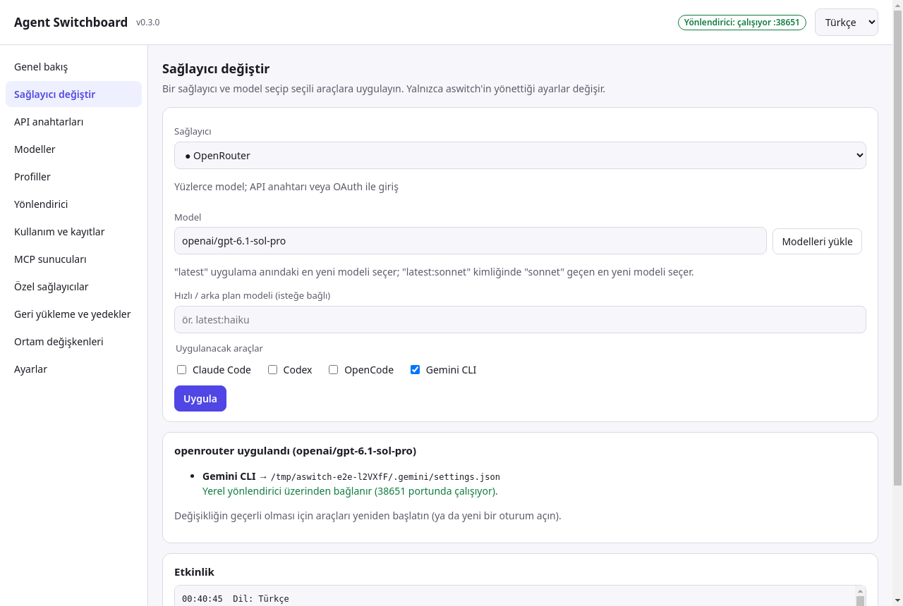 | 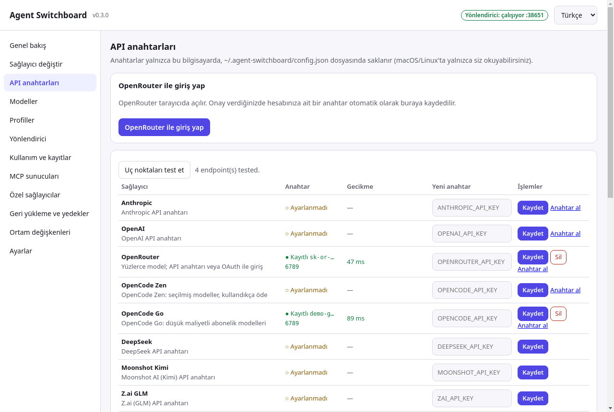 |
| **Canlı modeller ve arama** | **Yönlendirici** |
| 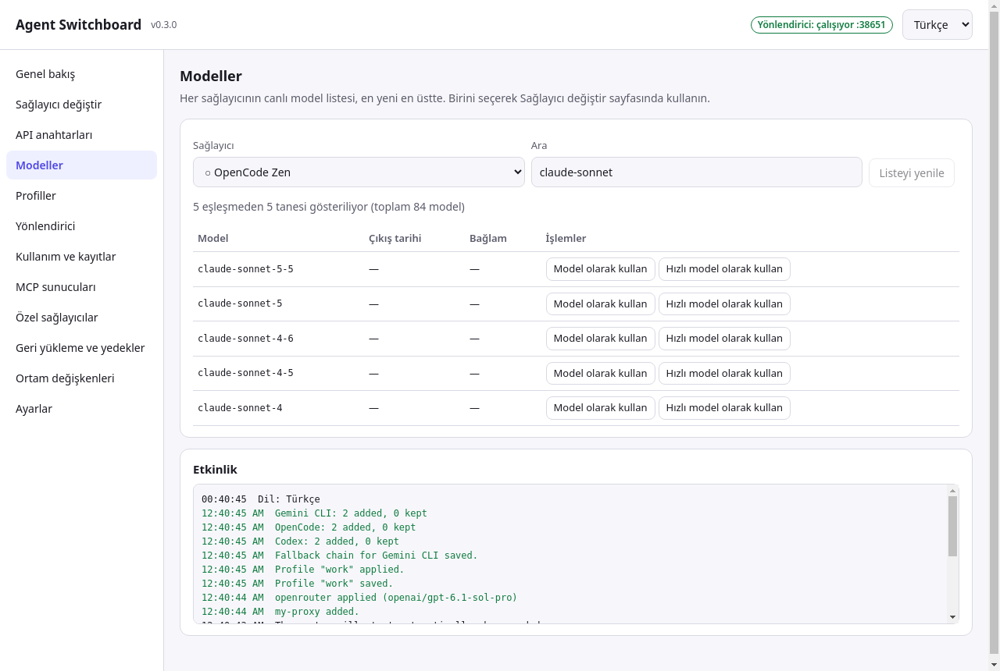 | 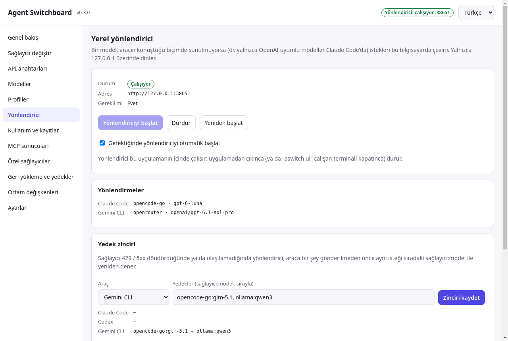 |
| **Profiller** | **Kullanım ve kayıtlar** |
| 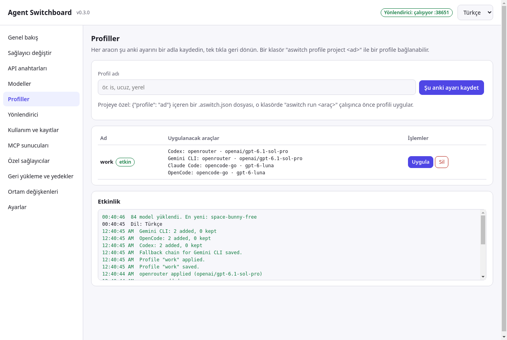 | 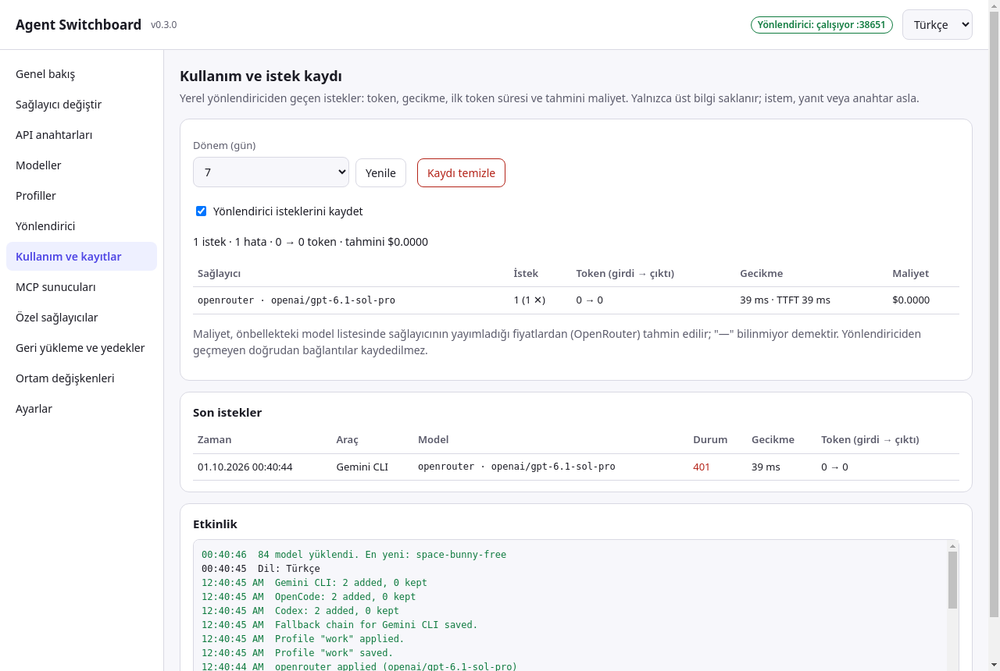 |
| **MCP sunucuları** | **Genel bakış** |
| 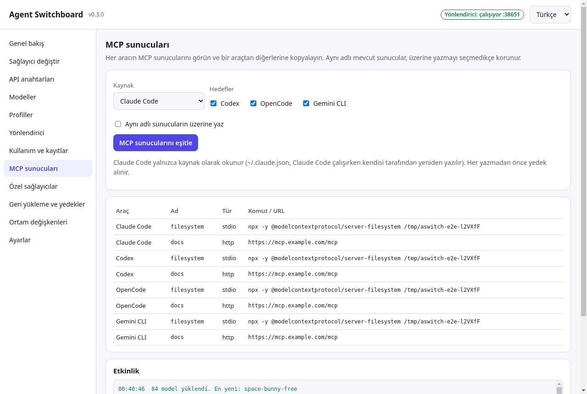 |  |

İngilizce arayüzün tüm sekmeleri: [README.md](README.md#screenshots)

## Kurulum

### Masaüstü uygulaması (çoğu kişi için önerilir)

[Son sürümden](https://github.com/cumabozkurt/agent-switchboard/releases/latest) sisteminize uygun dosyayı indirin:

| Sistem | Dosya | Not |
|---|---|---|
| **Windows 10/11 (x64)** | `Agent.Switchboard-Setup-<sürüm>-win-x64.exe` | Kurulum (Başlat menüsü kısayolu, kaldırıcı). |
| | `Agent.Switchboard-Portable-<sürüm>-win-x64.exe` | Kurulum gerektirmez; her yerden çalışır. |
| **macOS, Apple Silicon** | `Agent.Switchboard-<sürüm>-mac-arm64.dmg` (veya `.zip`) | M1/M2/M3/M4… |
| **macOS, Intel** | `Agent.Switchboard-<sürüm>-mac-x64.dmg` (veya `.zip`) | |
| **Linux (x64)** | `Agent.Switchboard-<sürüm>-linux-x86_64.AppImage` | `chmod +x` yapıp çalıştırın. |
| | `Agent.Switchboard-<sürüm>-linux-amd64.deb` | `sudo apt install ./Agent.Switchboard-*.deb` |

Paketler henüz **kod imzalı değildir**:

- **Windows:** SmartScreen "Windows bilgisayarınızı korudu" diyebilir. **Ek bilgi → Yine de çalıştır**'a tıklayın.
- **macOS:** Gatekeeper ilk açılışı engelleyebilir. Uygulamaya sağ tıklayın → **Aç** → **Aç**. macOS uygulamanın "hasarlı" olduğunu söylerse: `xattr -dr com.apple.quarantine "/Applications/Agent Switchboard.app"`.
- **Linux AppImage:** bazı dağıtımlarda `libfuse2` gerekir (`sudo apt install libfuse2`).

### CLI (terminal kullananlar için)

[Node.js](https://nodejs.org/) 18 veya üstü gerekir.

```bash
# macOS / Linux / Windows (PowerShell veya cmd)
npm install -g github:cumabozkurt/agent-switchboard
aswitch --version
```

Ya da depoyu klonlayarak:

```bash
git clone https://github.com/cumabozkurt/agent-switchboard
cd agent-switchboard
npm link          # `aswitch` komutunu kullanılabilir yapar
```

CLI kontrol panelini de içerir: `aswitch ui` aynı arayüzü tarayıcınızda açar (`127.0.0.1`'e bağlıdır, tek kullanımlık bir belirteçle korunur).

**Güncelleme:** masaüstü uygulaması ve `aswitch update` yeni sürüm çıktığında haber verir (yalnızca bildirir; bkz. [Sınırlamalar](#sınırlamalar)). Aynı `npm install -g …` komutunu yeniden çalıştırın ya da yeni masaüstü paketini indirin. **Kaldırma:** orijinal dosyalarınızı geri istiyorsanız önce `aswitch restore`, ardından `npm rm -g agent-switchboard` (veya uygulamayı kaldırın) ve `~/.agent-switchboard` klasörünü silin.

## İlk kullanım (5 dakika)

**Masaüstü uygulaması**

1. **Agent Switchboard**'u açın. **Genel bakış** her aracın şu an ne kullandığını gösterir. Henüz hiçbir şey değişmedi.
2. **API anahtarları** sekmesine gidin. Sağlayıcınızın anahtarını yapıştırıp **Kaydet**'e basın ya da tarayıcı üzerinden anahtar almak için **OpenRouter ile giriş yap**'a basın.
3. **Sağlayıcı değiştir** sekmesine gidin. Sağlayıcıyı seçin, **Modelleri yükle**'ye tıklayın (ya da `latest` yazın), araçları işaretleyin ve **Uygula**'ya basın.
   
4. Sonuçta *"Yerel yönlendirici üzerinden bağlanır"* yazıyorsa **Yönlendiriciyi başlat**'a basın (ya da Yönlendirici sekmesindeki **Gerektiğinde yönlendiriciyi otomatik başlat** seçeneğini açık bırakın; varsayılan olarak açıktır).
5. Claude Code / Codex / OpenCode / Gemini CLI'ı yeniden başlatın ya da yeni bir oturum açın. Bu kadar.
6. Vazgeçtiniz mi? **Geri yükleme ve yedekler → Resmî girişi kullan** veya **Orijinalleri geri yükle**.

**CLI**

```bash
aswitch key set openrouter           # anahtarı ekrana yazmadan sorar
aswitch models openrouter --filter claude
aswitch use openrouter --model latest:claude-sonnet --tools claude
aswitch status
```

## Masaüstü uygulaması turu

| Sekme | Neler yapabilirsiniz |
|---|---|
| **Genel bakış** | Araç kartları (mod, sağlayıcı, model, uç nokta, dosya), yönlendirici durumu, ilk açılışta karşılama rehberi, kabuk değişkenleri ayarları geçersiz kılıyorsa uyarı, etkinlik günlüğü. |
| **Sağlayıcı değiştir** | Sağlayıcı, model (`latest` / `latest:filtre` ile), isteğe bağlı hızlı/arka plan modeli, araç seçimi, **Uygula**. Tam olarak neyin yazıldığını ve yönlendirici gerekip gerekmediğini gösterir. |
| **API anahtarları** | Sağlayıcı başına anahtar kaydet/kaldır (maskeli; kayıtlı ayardan mı ortam değişkeninden mi geldiğini gösterir), her sağlayıcının anahtar sayfasına bağlantı, OpenRouter OAuth girişi, **Uç noktaları test et** (gecikme + anahtar durumu). |
| **Profiller** | Mevcut ayarı bir adla kaydedin, profilleri uygulayın ya da silin; etkin profil işaretlenir. |
| **Modeller** | Her sağlayıcı için canlı liste, yenileme, arama kutusu, modele tıklayıp kullanma. |
| **Yönlendirici** | Çalışıyor / durdu / harici durumu, adres ve port, **Başlat / Durdur / Yeniden başlat**, otomatik başlatma seçeneği, mevcut yönlendirmeler, araç başına **yedek zinciri**. Uygulamadan çıkınca yönlendirici düzgünce durur. |
| **Kullanım ve kayıtlar** | Sağlayıcı/model başına istekler, token, gecikme, ilk token süresi, tahmini maliyet, son istekler; kaydı aç/kapat, temizle. |
| **MCP sunucuları** | Tüm araçların MCP sunucuları tek tabloda; bir araçtan diğerlerine kopyalama (aynı adlıları koru ya da üzerine yaz). |
| **Özel sağlayıcılar** | OpenAI uyumlu (isteğe bağlı olarak Anthropic uyumlu) her uç noktayı ekleyin: kimlik, ad, taban adresler, model listesi adresi, kablo API'si (Responses/Chat), anahtar değişkeni. Tekrar kaldırın. |
| **Geri yükleme ve yedekler** | Resmî girişe dönüş (Claude Pro/Max, ChatGPT), araç başına orijinal dosyaları geri yükleme, tüm zaman damgalı yedekleri listeleyip istediğinizi geri yükleme (önce mevcut dosyanın yedeği alınır). |
| **Ortam değişkenleri** | Codex/OpenCode anahtarları için kabuk profilinize ekleyeceğiniz satırlar (sh/zsh/bash, fish, PowerShell, cmd). Değerler **Anahtarları tam göster**'e basana kadar maskelidir. |
| **Ayarlar** | Dil (Otomatik / English / Türkçe), yönlendirici otomatik başlatma, **içe / dışa aktarma**, **güncellemeleri denetle**, aswitch'in kullandığı tüm dosya yolları, sürüm. |

**Tepsi / menü çubuğu:** uygulama açıkken simgesi kayıtlı profilleri, *tüm araçlar → resmî giriş*, yönlendiriciyi başlat/durdur, pencereyi aç ve çık seçeneklerini sunar. Pencereyi kapatmak uygulamadan (ve başlattığı yönlendiriciden) çıkar.

Dil seçici her zaman sağ üst köşededir. Menü çubuğu ve pencere başlığı da seçilen dile uyar.

## CLI başvurusu

Genel seçenek: `--lang en|tr` (ya da `ASWITCH_LANG=en|tr`). Komuttan önce yazın, ör. `aswitch --lang tr status`.

| Komut | Ne yapar | Örnek |
|---|---|---|
| `aswitch status [--json]` | Her aracın şu an ne kullandığını ve yönlendirici gerekip gerekmediğini gösterir. | `aswitch status` |
| `aswitch providers` | Hazır ve özel sağlayıcılar; `●` = anahtar mevcut. | `aswitch providers` |
| `aswitch key set <sağlayıcı> [anahtar]` | Anahtar kaydeder. `[anahtar]` verilmezse ekrana yazmadan sorar (kabuk geçmişine düşmez). | `aswitch key set opencode-go` |
| `aswitch key rm <sağlayıcı>` | Kayıtlı anahtarı siler. | `aswitch key rm openai` |
| `aswitch key get <sağlayıcı>` | Anahtarı yazdırır (`--codex-key command` bunu kullanır). | `aswitch key get openrouter` |
| `aswitch login openrouter [--port 3000]` | Tarayıcıda OpenRouter OAuth (PKCE); anahtar kaydedilir. | `aswitch login openrouter` |
| `aswitch models <sağlayıcı> [--refresh] [--filter x] [--limit 50] [--json]` | Canlı model listesi, en yeni en üstte. | `aswitch models opencode-zen --filter claude` |
| `aswitch use <sağlayıcı> [--model m] [--fast m] [--tools …] [--codex-key env\|command] [--port p]` | Sağlayıcıyı ve modeli araçlara uygular (varsayılan: kurulu tüm araçlar; `~/.gemini` varsa Gemini CLI de). | `aswitch use openrouter --model latest:claude-opus --fast latest:claude-haiku` |
| `aswitch official [--tools claude,codex,gemini]` | aswitch ayarlarını kaldırıp aracın kendi girişine döner. `--tools opencode` OpenCode'un orijinal dosyasını geri yükler. | `aswitch official` |
| `aswitch restore [--tools …]` | Dosyaları aswitch dokunmadan önceki hâline birebir getirir. | `aswitch restore --tools codex` |
| `aswitch backups` | Zaman damgalı yedekleri listeler. | `aswitch backups` |
| `aswitch backups restore <kimlik> <dosya>` | Tek bir yedeği geri yükler (önce mevcut dosyanın yedeği alınır). | `aswitch backups restore 2026-09-30T21-08-51-439Z claude.json` |
| `aswitch provider add <kimlik> --openai-base URL [--anthropic-base URL] [--models-url URL] [--wire responses\|chat] [--key-env AD] [--label ad]` | Özel sağlayıcı ekler. | `aswitch provider add myproxy --openai-base http://localhost:8000/v1 --wire chat` |
| `aswitch provider rm <kimlik>` | Özel sağlayıcıyı (ve kayıtlı anahtarını) siler. | `aswitch provider rm myproxy` |
| `aswitch router [--port 3456]` | Yerel çeviri yönlendiricisini ön planda çalıştırır (Ctrl+C düzgünce durdurur). | `aswitch router` |
| `aswitch run <claude\|codex\|opencode\|gemini> [argümanlar…]` | Aracı, kayıtlı anahtar ortamında olacak şekilde (ve önce klasörün profili uygulanarak) başlatır; argümanlar aynen iletilir. | `aswitch run codex --full-auto` |
| `aswitch profile save\|use\|rm <ad>`, `aswitch profile list` | Araçların şu an kullandığını kaydet / uygula / sil / listele. | `aswitch profile save ucuz` |
| `aswitch profile project <ad>` | Bulunduğunuz klasöre `.aswitch.json` yazar; `aswitch run` burada o profili uygular. | `aswitch profile project is` |
| `aswitch ping [sağlayıcı …] [--json]` | Uç nokta gecikmesi ve anahtar durumu. | `aswitch ping openrouter deepseek` |
| `aswitch fallback [set <araç> s:model … \| clear <araç>]` | 429/408/5xx/ağ hatasında yönlendiricinin yedek zinciri (claude, codex, gemini). | `aswitch fallback set claude opencode-go:glm-5.1 ollama:qwen3` |
| `aswitch usage [--days 7] [--recent] [--json] [--clear] [--log on\|off]` | Yönlendirici istek kaydı: token, gecikme, ilk token süresi, tahmini maliyet. | `aswitch usage --recent` |
| `aswitch mcp [list] [--json]` | Her aracın MCP sunucuları. | `aswitch mcp` |
| `aswitch mcp sync [--from claude] [--to codex,opencode,gemini] [--only a,b] [--overwrite]` | MCP sunucularını araçlar arasında kopyalar (önce yedek alınır). | `aswitch mcp sync --to gemini` |
| `aswitch export [dosya] [--with-keys]` / `aswitch import <dosya> [--overwrite]` | Özel sağlayıcıları, profilleri, yedek zincirlerini ve ayarları taşır (anahtarlar yalnızca istenirse). | `aswitch export ayar.json` |
| `aswitch update` | GitHub'da yeni sürüm var mı bakar (`ASWITCH_NO_UPDATE_CHECK=1` otomatik denetimi kapatır). | `aswitch update` |
| `aswitch env [--shell sh\|fish\|powershell\|cmd] [--all]` | Etkin Codex/OpenCode anahtarları için `export` satırlarını yazdırır. | `aswitch env --shell powershell` |
| `aswitch ui [--port 4567] [--no-open]` | Kontrol panelini tarayıcıda açar. | `aswitch ui` |
| `aswitch lang [en\|tr\|auto]` | Arayüz dilini gösterir ya da ayarlar (ayarlara kaydedilir). | `aswitch lang tr` |
| `aswitch --version`, `aswitch --help` | Sürüm / yardım. | |

**Model takma adları:** `--model latest` sağlayıcının en yeni modelini, `--model latest:sonnet` kimliğinde `sonnet` geçen en yeni modeli seçer. Tarih bilgisi olmayan listelerde (OpenCode Zen/Go) sıralama sürüm numarasına göredir; bu yüzden `latest:claude-opus` gibi belirli bir filtre kullanın.

## Tarifler

### Claude Code'da (ve Codex'te) OpenRouter

```bash
aswitch login openrouter                         # ya da: aswitch key set openrouter
aswitch use openrouter --model latest:claude-sonnet --fast latest:claude-haiku --tools claude,codex
aswitch run codex                                # Codex OPENROUTER_API_KEY'i ortamdan okur
```

Claude Code, OpenRouter'ın Anthropic uyumlu uç noktasına **doğrudan** bağlanır; Codex OpenRouter'ın Responses API'sini doğrudan kullanır. Yönlendirici gerekmez.

### Claude Code ve Codex içinde OpenCode Zen / Go

```bash
aswitch key set opencode-zen                     # aynı anahtar opencode-go için de geçerli (OPENCODE_API_KEY)
aswitch use opencode-zen --model latest:claude-opus --tools claude     # doğrudan (/messages)
aswitch use opencode-zen --model latest:gpt --tools codex              # doğrudan (/responses)
aswitch use opencode-go  --model latest:gpt --tools claude             # yönlendirici: Messages → Responses
aswitch use opencode-go  --model glm-5 --tools codex                   # yönlendirici: Responses → Chat
aswitch router                                                          # açık kalsın (ya da masaüstü uygulamasını kullanın)
```

### Claude Code'da OpenAI modelleri

```bash
aswitch key set openai
aswitch use openai --model gpt-5 --tools claude
aswitch router          # Claude Code → http://127.0.0.1:3456 → OpenAI Responses API
```

### Gemini CLI'ı herhangi bir sağlayıcıyla kullanmak

```bash
aswitch key set gemini
aswitch use gemini --model gemini-2.5-pro --tools gemini          # doğrudan (Google AI Studio anahtarı)
aswitch use openrouter --model latest:claude-sonnet --tools gemini # yönlendirici: Gemini API → Anthropic Messages
aswitch run gemini                                                  # ya da "gemini"yi normal başlatın
```

Gemini CLI `~/.gemini/.env` dosyasını yalnızca proje klasöründe (ya da üst klasörlerinde) `.env` yoksa okur. `aswitch run gemini` değişkenleri doğrudan verdiği için her yerde çalışır.

### Profiller, projeye özel ayar ve yedek zinciri

```bash
aswitch use deepseek --model deepseek-chat --tools claude,codex && aswitch profile save ucuz
aswitch official && aswitch profile save abonelik
cd ~/is/musteri-a && aswitch profile project ucuz    # bu klasör hep "ucuz" kullanır
aswitch run claude                                    # "ucuz"u uygular, sonra Claude Code'u başlatır
aswitch fallback set claude openrouter:anthropic/claude-sonnet-4.5   # DeepSeek çökerse
```

### MCP sunucularını paylaşmak

```bash
aswitch mcp                                   # her araçta ne var
aswitch mcp sync --from claude --to codex,opencode,gemini
```

### Ollama ile yerel model

```bash
aswitch use ollama --model qwen3-coder --tools opencode,codex
```

### Kendi ağ geçidiniz / vekil sunucunuz

```bash
aswitch provider add mygw --openai-base https://gw.example.com/v1 --wire chat --key-env MYGW_KEY
aswitch key set mygw
aswitch use mygw --model my-model --tools claude,codex,opencode
```

### Abonelik girişine geri dönmek

```bash
aswitch official                  # Claude Code → Claude Pro/Max girişi, Codex → ChatGPT girişi
```

Yalnızca aswitch'in yazdığı ayarlar kaldırılır; önceki `model` satırınız geri konur.

### Tam geri yükleme

```bash
aswitch restore                   # her dosya aswitch'ten önceki hâline bayt bayt döner
```

aswitch'ten önce var olmayan bir dosyayı `restore` yeniden siler.

## Nasıl çalışır

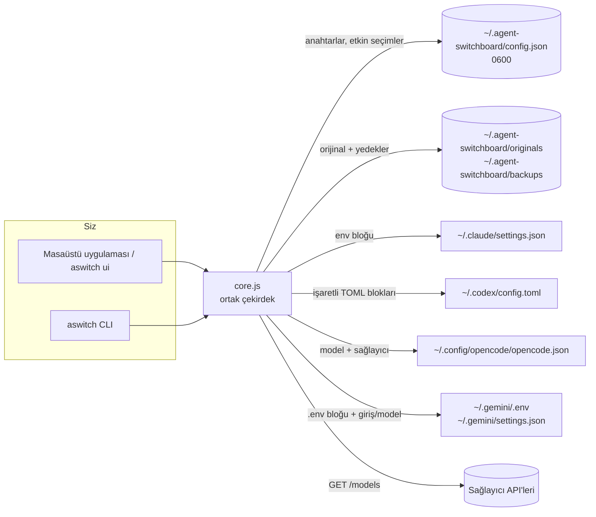

**Uygula'ya bastığınızda** (ya da `aswitch use` çalıştırdığınızda) olanlar:

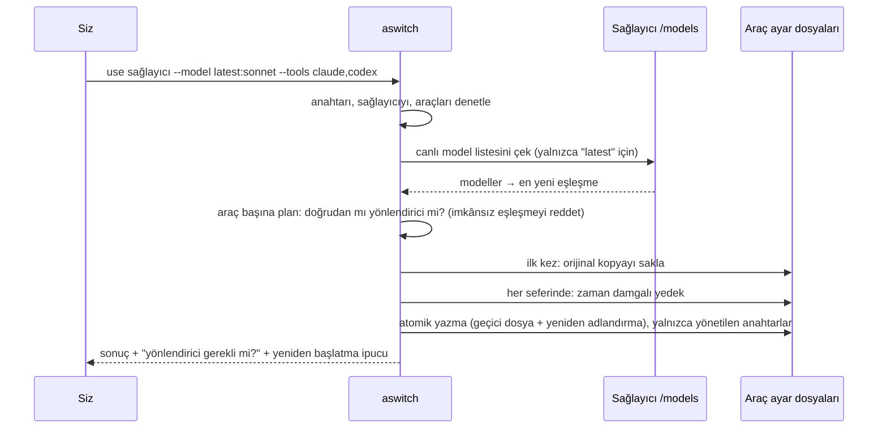

**Yönlendirici nasıl çevirir** (yalnızca modelin API'si aracınkinden farklıysa):

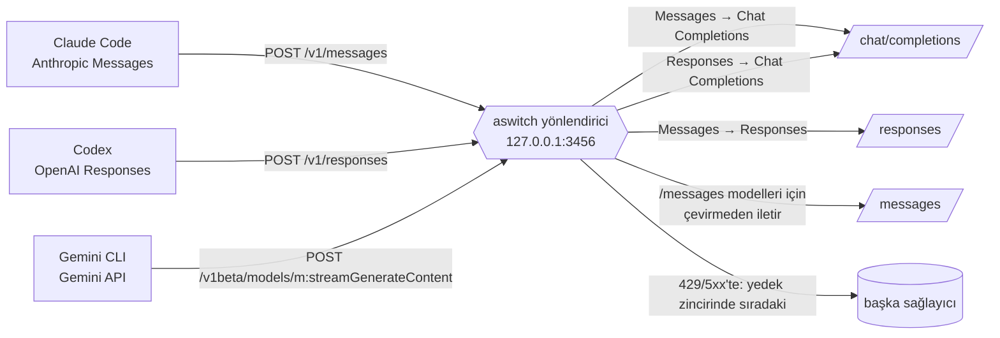

Yönlendirici her istekte ayarları yeniden okur; model değiştirmek için yeniden başlatmak gerekmez. Metin, araç çağrıları/sonuçları, görseller, akış (SSE) ve düşünme (reasoning) çevrilir; hatalar çağıran aracın kendi hata biçiminde döner. Gemini CLI istekleri önce Anthropic Messages'a çevrilir, sonra Claude Code ile aynı yolu izler. Bir istek, araca henüz bir şey akmadan 429, 408, 5xx ya da ağ hatasıyla başarısız olursa aracın yedek zincirindeki sıradaki kayıt denenir. Her isteğin özet bilgisi (içerik değil) kullanım kaydına yazılır.

## Hangi dosyalara tam olarak ne yazılır

| Araç | Dosya (geçersiz kılma) | aswitch ne yazar |
|---|---|---|
| Claude Code | `~/.claude/settings.json` (`CLAUDE_CONFIG_DIR`) — Windows'ta `%USERPROFILE%\.claude\settings.json` | `env` içine: `ANTHROPIC_BASE_URL`, `ANTHROPIC_AUTH_TOKEN` (Anthropic'in kendisi için `ANTHROPIC_API_KEY`), `ANTHROPIC_MODEL`, `ANTHROPIC_DEFAULT_OPUS_MODEL`, `ANTHROPIC_DEFAULT_SONNET_MODEL`, `ANTHROPIC_DEFAULT_FABLE_MODEL`, `ANTHROPIC_DEFAULT_HAIKU_MODEL` (hızlı model), `CLAUDE_CODE_SUBAGENT_MODEL`; ayrıca üst düzey `model`. `0600` izinle yazılır. |
| Codex | `~/.codex/config.toml` (`CODEX_HOME`) | En üstte işaretli bir blok (`model_provider = "aswitch"`, `model`) ve sonda işaretli bir `[model_providers.aswitch]` tablosu (`name`, `base_url`, `wire_api = "responses"`, `env_key`, `env_key_instructions`; `--codex-key command` ile `auth` komutu). Geri kalan her şey, CRLF satır sonları dahil, korunur. |
| OpenCode | `~/.config/opencode/opencode.json` (veya mevcut `opencode.jsonc`; `XDG_CONFIG_HOME`) | `model` (ör. `openrouter/anthropic/claude-sonnet-4.5`); OpenCode'un tanımadığı sağlayıcılar için anahtarı `{env:AD}` olarak kullanan, `@ai-sdk/openai-compatible` (Responses için `@ai-sdk/openai`) tabanlı bir `provider.<kimlik>` bloğu. |
| Gemini CLI | `~/.gemini/.env` ve `~/.gemini/settings.json` (`GEMINI_CLI_HOME`) | `.env` içinde işaretli bir blok (en sonda, `0600`): `GOOGLE_GEMINI_BASE_URL` (yönlendirici ya da Google), `GEMINI_API_KEY`, `GEMINI_MODEL`. `settings.json` içinde: `model.name` ve `security.auth.selectedType = "gemini-api-key"`. Önceki değerler hatırlanır ve `official` ile geri konur. |
| MCP eşitleme (yalnızca siz çalıştırınca) | Codex `config.toml` (kendi işaretli bloğu), OpenCode `mcp`, Gemini `mcpServers` | Yalnızca kopyaladığınız sunucular; önce her şeyin yedeği alınır. `~/.claude.json` yalnızca okunur. |
| Proje | `.aswitch.json` (yalnızca `aswitch profile project` ile) | `{"profile": "<ad>"}` |
| aswitch | `~/.agent-switchboard/` (`ASWITCH_DIR`) | `config.json` (anahtarlar, özel sağlayıcılar, etkin seçimler, profiller, yedek zincirleri, dil, yönlendirici portu; `0600`), `usage.jsonl` (yönlendirici istek özetleri, `0600`, en fazla 5000 satır), `originals/`, `backups/`, model önbelleği, güncelleme denetimi önbelleği. Klasör `0700`. |

`aswitch use openrouter --model anthropic/claude-sonnet-4.5 --fast anthropic/claude-haiku-4.5` sonrası gerçek örnekler için İngilizce README'deki [örneklere](README.md#exactly-which-files-are-touched) bakın; içerik dilden bağımsızdır.

**Codex ve OpenCode için anahtarlar** ortam değişkenlerinden okunur (iki araç da böyle tasarlanmıştır). Birini seçin:

- `aswitch run codex` / `aswitch run opencode` — değişkeni yalnızca o çalıştırma için ayarlar.
- `aswitch env` çıktısını kabuk profilinize ekleyin (**Ortam değişkenleri** sekmesi her kabuk için gösterir).
- `aswitch use … --codex-key command` — Codex anahtarı `aswitch key get <sağlayıcı>` komutundan ister (Codex'in `[model_providers.<id>.auth]` özelliği). Yalnızca CLI kurulumlarında.

## Uyumluluk tabloları

### Araçlar × sağlayıcılar

✅ doğrudan · 🔁 yerel yönlendirici üzerinden · ❌ mümkün değil

| Sağlayıcı | Claude Code | Codex | OpenCode | Gemini CLI | Anahtar değişkeni |
|---|---|---|---|---|---|
| Anthropic | ✅ | 🔁 (Chat) | ✅ | 🔁 | `ANTHROPIC_API_KEY` |
| OpenAI | 🔁 (Responses) | ✅ | ✅ | 🔁 | `OPENAI_API_KEY` |
| OpenRouter | ✅ | ✅ | ✅ | 🔁 | `OPENROUTER_API_KEY` (ya da OAuth) |
| OpenCode Zen | modele göre ¹ | modele göre ¹ | ✅ | modele göre ¹ | `OPENCODE_API_KEY` |
| OpenCode Go | modele göre ¹ | modele göre ¹ | ✅ | modele göre ¹ | `OPENCODE_API_KEY` |
| DeepSeek | ✅ | 🔁 (Chat) | ✅ | 🔁 | `DEEPSEEK_API_KEY` |
| Moonshot Kimi | ✅ | 🔁 (Chat) | ✅ | 🔁 | `MOONSHOT_API_KEY` |
| Z.ai GLM | ✅ | 🔁 (Chat) | ✅ | 🔁 | `ZAI_API_KEY` |
| MiniMax | ✅ | 🔁 (Chat) | ✅ | 🔁 | `MINIMAX_API_KEY` |
| xAI (Grok) | 🔁 (Responses) | ✅ | ✅ | 🔁 | `XAI_API_KEY` |
| Groq · Mistral · Cerebras · NVIDIA NIM | 🔁 (Chat) | 🔁 (Chat) | ✅ | 🔁 | `GROQ_API_KEY` · `MISTRAL_API_KEY` · `CEREBRAS_API_KEY` · `NVIDIA_API_KEY` |
| SiliconFlow | ✅ | 🔁 (Chat) | ✅ | 🔁 | `SILICONFLOW_API_KEY` |
| Google Gemini | 🔁 (Chat) | 🔁 (Chat) | ✅ | ✅ | `GEMINI_API_KEY` |
| Ollama (yerel) | ✅ | ✅ (Ollama ≥ 0.13.3) | ✅ | 🔁 | yok |
| LM Studio (yerel) | ✅ | ✅ | ✅ | 🔁 | yok |
| Özel | verdiğiniz adreslere bağlı | | | | sizin seçiminiz |

¹ OpenCode Zen ve Go her modeli kendi uç noktasında sunar (sonraki tabloya bakın).

### Model uç noktası × araç

| Model şurada sunuluyor… | Claude Code | Codex |
|---|---|---|
| `/messages` (Anthropic) — ör. Zen `claude-*`, çoğu `qwen*`; Go `minimax-*`, `qwen*` | ✅ doğrudan | ❌ |
| `/responses` (OpenAI Responses) — ör. Zen/Go `gpt-*`, `grok-*` | 🔁 Messages → Responses | ✅ doğrudan |
| `/chat/completions` — diğer her şey | 🔁 Messages → Chat | 🔁 Responses → Chat |
| Google'a özgü (Zen `gemini-*`) | ❌ | ❌ |

Ana model ile `--fast` modeli farklı uç noktalardaysa ikisi de yönlendiriciden geçer (`/messages` modelleri çevrilmeden iletilir).

### Anahtar ve kimlik doğrulama modları

| Mod | Claude Code | Codex | OpenCode | Gemini CLI |
|---|---|---|---|---|
| Kayıtlı API anahtarı | `settings.json` içine yazılır (`0600`) | `aswitch run` / `aswitch env` ile ortam değişkeni | `aswitch run` / `aswitch env` ile `{env:AD}` | doğrudan: `~/.gemini/.env` içine yazılır (`0600`); yönlendirici: yer tutucu anahtar |
| Ortamınızdaki anahtar | kayıtlı yoksa kullanılır | ✅ | ✅ | ✅ |
| OpenRouter OAuth (PKCE) | ✅ girişten sonra anahtar kaydedilir | ✅ | ✅ | ✅ |
| Codex kimlik komutu | — | `--codex-key command` → `aswitch key get` | — | — |
| Abonelik girişi (Claude Pro/Max, ChatGPT, Google) | `aswitch official` → `claude /login` | `aswitch official` → `codex login` | — | `aswitch official` → Gemini CLI'ın kendi girişi |

### Platformlar

| | Windows 10/11 | macOS | Linux |
|---|---|---|---|
| CLI (Node 18/20/22) | ✅ CI'da test edilir | ✅ CI'da test edilir | ✅ CI'da test edilir |
| Masaüstü uygulaması | ✅ x64 kurulum + taşınabilir | ✅ arm64 + x64 (dmg, zip) | ✅ x64 AppImage + deb |
| Kabuk satırları (`aswitch env`) | PowerShell, cmd | sh/zsh/bash, fish | sh/zsh/bash, fish |
| Masaüstü E2E testi (Electron üzerinde Playwright, 40+ denetim) | yalnızca CI derlemesi | yalnızca CI derlemesi | ✅ CI'da her gönderimde (Xvfb) |

## Dil (Türkçe / English)

- **Masaüstü:** başlıktaki dil menüsü (ve Ayarlar'da, *Otomatik* seçeneğiyle). Menü çubuğu ve pencere başlığı da değişir. Seçim kaydedilir.
- **CLI:** `aswitch --lang tr status`, `ASWITCH_LANG=tr aswitch …` ya da `aswitch lang tr` ile kalıcı olarak (`aswitch lang auto` otomatiğe döner).
- **Öncelik:** `--lang` / arayüz seçimi › `ASWITCH_LANG` › kayıtlı `lang` › işletim sistemi dili (Electron `app.getLocale()`, `LC_ALL`/`LC_MESSAGES`/`LANG`/`LANGUAGE`, `Intl`) › İngilizce.
- Araçlarda görünen yönlendirici hata mesajları da çevrilir. Yönlendiricinin modellere giden istemlere eklediği metinler bilerek İngilizce kalır (modeller en iyi onu anlar).

Yeni bir dil eklemek = `src/i18n/` içinde aynı anahtarlara sahip bir dosya. Bir test tüm kataloglarda anahtarların ve yer tutucuların aynı olduğunu, koddaki her anahtarın var olduğunu denetler.

## Güvenlik ve gizlilik

- **Telemetri yok, hesap yok, bulut yok.** aswitch yalnızca seçtiğiniz sağlayıcı adresleriyle (model listeleri, OAuth, uç nokta testi) ve yerel araçlarınızla konuşur; ayrıca güncelleme bildirimi için en fazla 12 saatte bir GitHub'a kimliksiz tek bir istek atar (`ASWITCH_NO_UPDATE_CHECK=1` kapatır).
- **Kullanım kaydı:** yalnızca özet bilgi (zaman, araç, sağlayıcı, model, durum, gecikme, token sayıları). İstem, yanıt ya da anahtar asla yazılmaz. `aswitch usage --log off` ile kapatılır.
- **Saklanan anahtarlar:** `~/.agent-switchboard/config.json` `0600`, klasörü `0700` izinlidir (macOS/Linux). Windows'ta dosyalar kullanıcı profilinizdedir ve hesabınızın NTFS izinleriyle korunur. Anahtarlar şifrelenmez; kullanıcı dosyalarınızı okuyabilen biri onları da okuyabilir (araçların kendi ayar dosyalarında olduğu gibi). Claude Code'un `settings.json` dosyası belirteç içerdiği için `0600` ile yazılır.
- **Yerel sunucular:** kontrol paneli ve yönlendirici yalnızca `127.0.0.1` üzerinde dinler. Panel her açılışta rastgele bir belirteç, eşleşen bir `Host` başlığı (DNS rebinding koruması) ve `Content-Type: application/json` ister (siteler arası form gönderimlerini engeller), gövdeyi 1 MB ile sınırlar ve katı bir Content-Security-Policy gönderir. Yönlendirici `Origin` başlığı taşıyan (tarayıcı) ya da yerel olmayan `Host` ile gelen istekleri reddeder.
- **Arayüz:** hiçbir yerde `innerHTML` yok; her değer metin olarak eklenir. Dış bağlantılar uygulamanın içinde değil, sistem tarayıcınızda açılır.
- **Komutlar:** `aswitch run` macOS/Linux'ta aracı kabuk olmadan başlatır; Windows'ta her argümanı `cmd.exe` için tırnaklar. Adresler kabuk kullanılmadan açılır.
- **Maskeleme:** anahtarlar uygulamada (anahtar listesi, Ortam değişkenleri sekmesi) siz istemedikçe maskelidir; `aswitch status` anahtar yazdırmaz. `aswitch env` ve `aswitch key get` ise bilerek yazdırır (kabuk profiliniz / Codex kimlik komutu için).
- Bir sorun mu buldunuz? [SECURITY.md](SECURITY.md) dosyasına bakın.

## OAuth ve kullanım koşulları

- **OpenRouter** uygulamalar için resmî bir OAuth PKCE akışı sunar; `aswitch login openrouter` bunu kullanır ve elde edilen anahtarı diğer anahtarlar gibi saklar.
- **Claude Pro/Max, ChatGPT ve Google abonelikleri** kendi resmî istemcileri içindir. aswitch bu giriş belirteçlerini **asla** kopyalamaz, okumaz veya başka araçlara iletmez; hesapları havuzda toplamaz. `aswitch official` yalnızca aswitch ayarlarını kaldırır; Claude Code, Codex ve Gemini CLI yeniden kendi girişlerini kullanır. Profil dışa aktarımı bu belirteçleri asla içermez.
- Her sağlayıcının koşullarına (ör. hız sınırları, API anahtarlarının izin verilen kullanımı) uymak sizin sorumluluğunuzdadır.

## Sorun giderme / SSS

<details><summary><b>Sağlayıcıyı uyguladım ama araç hâlâ eskisini kullanıyor.</b></summary>

Aracı yeniden başlatın ya da yeni bir oturum açın. `aswitch status` ile kontrol edin; dosyayı geçersiz kılan bir ortam değişkeni varsa uyarır: Claude Code için kabuğunuzda dışa aktarılmış `ANTHROPIC_MODEL`, `ANTHROPIC_BASE_URL` veya `ANTHROPIC_API_KEY`, `settings.json`'dan önce gelir; Gemini CLI için kabuktaki `GEMINI_API_KEY` / `GOOGLE_GEMINI_BASE_URL` ya da proje klasöründeki bir `.env` dosyası `~/.gemini/.env`'den önce gelir (`aswitch run gemini` kullanın). Proje düzeyindeki `.claude/settings.json` ya da `.claude/settings.local.json` dosyaları da kullanıcı ayarlarını geçersiz kılar.
</details>

<details><summary><b>"Yerel yönlendirici üzerinden bağlanır, ancak yönlendirici çalışmıyor."</b></summary>

Başlatın: masaüstünde **Yönlendirici → Yönlendiriciyi başlat** (ya da otomatik başlatmayı açık tutun) veya açık kalacak bir terminalde `aswitch router`. CLI yönlendiricisinde terminali kapatmak onu durdurur.
</details>

<details><summary><b>"3456 portu zaten kullanımda."</b></summary>

Başka bir program (ya da başka bir aswitch yönlendiricisi) portu kullanıyor. Masaüstü uygulaması zaten çalışan bir aswitch yönlendiricisini algılar ve *harici* olarak gösterir. Aksi hâlde başka bir port kullanın: `aswitch use <sağlayıcı> … --port 3999`, ardından `aswitch router`. Seçilen port hatırlanır.
</details>

<details><summary><b>Codex ortam değişkeninin eksik olduğunu söylüyor.</b></summary>

Codex'i `aswitch run codex` ile başlatın, ya da `aswitch env` çıktısını kabuk profilinize ekleyip yeni bir terminal açın, ya da `--codex-key command` kullanın.
</details>

<details><summary><b>"… geçerli bir JSON değil. Dosyaya dokunulmadı."</b></summary>

Ayar dosyanızda sözdizimi hatası var (Claude Code katı JSON ister). aswitch ayrıştıramadığı bir dosyanın üzerine asla yazmaz. Dosyayı düzeltin ya da **Geri yükleme ve yedekler** sekmesinden bir yedeği geri yükleyin. OpenCode'un `.jsonc` yorumları desteklenir.
</details>

<details><summary><b>Model listesi boş ya da eski.</b></summary>

**Listeyi yenile**'ye basın (ya da `--refresh`). Listeler 6 saat önbelleklenir. Bazı sağlayıcılar `/models` için anahtar ister. Ağ hataları nedeniyle birlikte gösterilir (ör. `ECONNREFUSED`, `ENOTFOUND`). Çevrimdışıyken aswitch önce son önbelleğe, o da yoksa sürümle gelen anlık görüntüye düşer (OpenRouter, OpenCode Zen, OpenCode Go; depoda her gün yenilenir).
</details>

<details><summary><b>Her şeyi nasıl geri alırım?</b></summary>

`aswitch restore` (ya da uygulamada **Orijinalleri geri yükle**). Ardından `~/.agent-switchboard` klasörünü silebilirsiniz.
</details>

<details><summary><b>Claude Code / Codex IDE uzantıları ve masaüstü uygulamalarıyla çalışır mı?</b></summary>

Aynı kullanıcı ayar dosyalarını okurlar; bu yüzden değişiklikler, her ürünün bu dosyaları okuduğu ölçüde onlara da yansır.
</details>

## Sınırlamalar

- Düşünme okunabilir metin olarak çevrilir (akıl yürütme özetleri / `reasoning_content`); şifreli akıl yürütme sağlayıcılar arasında taşınmaz. Claude Code → Responses durumsuzdur (`store: false`). `stop_sequences` yalnızca Chat sağlayıcılarına ulaşır (en fazla 4). Sağlayıcıda barındırılan araçlar (web arama) iletilmez. `count_tokens` yaklaşık bir tahmindir.
- Codex yalnızca `/messages` ile sunulan modelleri kullanamaz (Responses → Messages çevirisi yok). OpenCode Zen'deki Google'a özgü modeller (`gemini-*`) Claude Code, Codex ya da Gemini CLI'dan kullanılamaz.
- Gemini CLI: proje klasöründeki (ya da bir üst klasördeki) `.env` dosyası `~/.gemini/.env`'yi gizler; orada `aswitch run gemini` kullanın. Gemini'nin kendi Google girişi modlarına (Code Assist / Vertex) `official` dokunmaz.
- Yedek zinciri yalnızca ilk bayt akmadan önce işe yarar; yarıda kopan bir akış yeniden oynatılmaz (çıktı iki kez yazılırdı). Yük dengeleme ya da devre kesici yok (tek kullanıcılı bir araç).
- Kullanım kaydındaki maliyet, sağlayıcının model listesindeki fiyatlardan yapılan bir **tahmindir** (OpenRouter yayımlar; çoğu yayımlamaz → "—"). Doğrudan bağlantılar (yönlendiricisiz) kaydedilmez.
- MCP eşitleme: Claude Code yalnızca kaynaktır (çalışırken `~/.claude.json`'u yeniden yazar). OAuth kullanan uzak MCP sunucularına her araçta yeniden giriş yapmak gerekir.
- Güncellemeler **yalnızca bildirilir**: paketler imzasız ve macOS imzasız güncellemeleri otomatik kurmaz; bu yüzden uygulama sessizce kurmak yerine yeni sürümü ve bağlantısını gösterir. Derin bağlantılar (`aswitch://`) henüz yok.
- Tepsi simgesi yalnızca masaüstü uygulaması açıkken vardır; pencereyi kapatmak uygulamadan çıkar.
- Anahtarlar işletim sistemi anahtar zincirinde değil, izinle korunan bir dosyada saklanır.
- Masaüstü paketleri imzasızdır. Linux paketleri yalnızca x64'tür (henüz arm64 yok).
- Windows'ta `aswitch run` argümanları `cmd.exe` üzerinden iletir; `%DEĞİŞKEN%` içeren argümanlar cmd tarafından genişletilebilir.
- Electron uçtan uca testi Linux'ta çalışır (CI, her gönderimde); macOS ve Windows masaüstü paketleri CI'da üretilir ama arayüzleri otomatik test edilmez.

## Benzer projelerle karşılaştırma

0.3.0 için 33 etkin projeyi klonlayıp okuduk — tam tablo ve notlar [docs/COMPETITIVE-ANALYSIS.md](docs/COMPETITIVE-ANALYSIS.md) dosyasında (İngilizce). En bilinen üçüyle, README ve kodlarında denetlediğimiz noktalarda karşılaştırma (Eylül 2026):

| | **Agent Switchboard** | [cc-switch](https://github.com/farion1231/cc-switch) | [cc-switch-cli](https://github.com/SaladDay/cc-switch-cli) | [claude-code-router](https://github.com/musistudio/claude-code-router) |
|---|---|---|---|---|
| Biçim | Masaüstü uygulaması + CLI + tarayıcı paneli | Masaüstü uygulaması (Tauri) | TUI + CLI (cc-switch uyarlaması) | CLI / yerel servis + web arayüzü |
| Yönetilen araçlar | Claude Code, Codex, OpenCode, Gemini CLI | Claude Code, Codex, Gemini CLI, OpenCode, OpenClaw, Claude Desktop ve fazlası | Claude Code, Codex, Gemini CLI, OpenCode, OpenClaw, Hermes, pi | Claude Code (yönlendirme katmanı) |
| Yerel protokol çevirisi | ✅ Messages⇄Chat, Messages⇄Responses, Responses⇄Chat, Gemini⇄Messages | Biçim dönüştüren yerel vekil | Yerel vekil | ✅ (temel özellik, dönüştürücüler) |
| Hatada yedeğe geçiş | ✅ araç başına zincir | ✅ | ✅ | ✅ yedek modeller, yeniden deneme |
| Kullanım / maliyet görünümü | ✅ (yönlendirici istekleri, tahmini) | ✅ | — | ✅ kayıtlar |
| MCP sunucu eşitleme | ✅ 4 araç | ✅ | ✅ | — |
| Profiller / içe-dışa aktarma | ✅ + projeye özel | ✅ | ✅ | ayar dosyası |
| Tepsi / menü çubuğu | ✅ | ✅ | — (terminal) | — |
| Orijinal dosyalara bayt bayt dönüş | ✅ | — | yedekler | uygulanamaz |
| Çalışma zamanı bağımlılığı | 0 (yalnızca Node.js) | Yerel uygulama | Rust ikili dosyası | Node.js paketleri |
| Arayüz dilleri | English, Türkçe | birden çok | birden çok | — |

cc-switch'in özellik yelpazesi daha geniştir (yetenek/istem eşitleme, bulut eşitleme, derin bağlantılar, 90+ hazır ayar). Agent Switchboard; iki arayüzde de aynı özellikleri sunan bağımlılıksız bir CLI + uygulamaya, dört biçimli bir yönlendiriciye ve birebir geri yüklemeye odaklanır. Düzeltmelere açığız.

## Yol haritası

- Bir web sayfasından sağlayıcı/profil içe aktarmak için derin bağlantılar (`aswitch://…`)
- Senaryoya göre yönlendirme (uzun bağlam / görsel / arka plan işleri → farklı modeller)
- Anahtarlar için isteğe bağlı işletim sistemi anahtar zinciri desteği
- Sessiz otomatik güncellemeli imzalı/onaylı masaüstü paketleri, Linux arm64
- Daha fazla ajan (Qwen Code, Crush …) ve arayüz dili (katkılara açığız)

## Katkı

Katkılarınızı memnuniyetle karşılarız; [CONTRIBUTING.md](CONTRIBUTING.md) dosyasına bakın. Hızlı başlangıç:

```bash
git clone https://github.com/cumabozkurt/agent-switchboard && cd agent-switchboard
npm test                          # ~140 test, node:test, bağımlılık yok
cd desktop && npm install && npm run e2e   # Electron uçtan uca testi (Linux: xvfb-run -a npm run e2e)
cd desktop && npm install && npm start
```

## Lisans

[MIT](LICENSE) © Cuma Bozkurt
